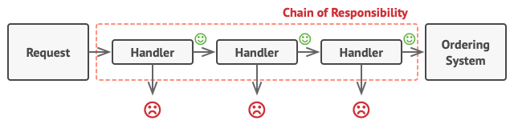
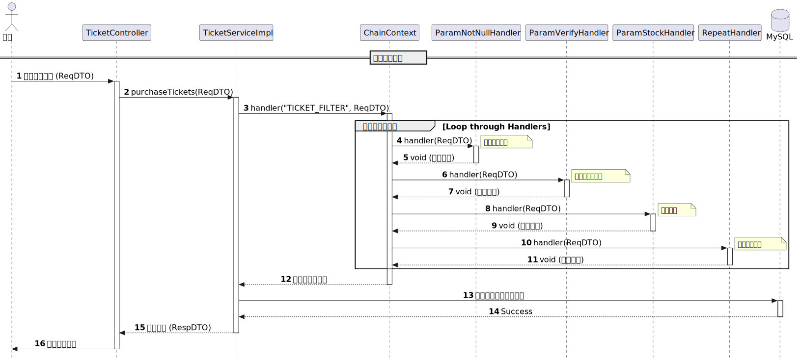

# 12306购票校验责任链

## 1. 背景

在12306项目中，用户可以发起购票请求，在真正执行创建订单-扣减库存等操作之前，需要先验证一下当前用户是否有购票资格，其伪代码如下：

```java
public TicketPurchaseRespDTO purchaseTickets(PurchaseTicketReqDTO requestParam) {
  // 1. 检查用户传入的参数是否不为空
  // 2. 检查用户传入的参数是否符合要求 例如其选择要购买的车次是否存在
  // 3. 检查用户是否重复购票
  // 4. 检查库存是否充足
  // ...
  // 执行真正的创建订单-扣减库存等购票逻辑
}
```

在这样的代码，存在以下问题：

1. 违背单一职责原则。Service类不仅需要包含购票逻辑，还需要包含购票前的校验逻辑，导致这个类中的方法过于臃肿冗长。
2. 违背开闭原则。开闭原则指的是对拓展开放，对修改关闭，如果后续要添加新的校验逻辑，需要修改purchaseTickets方法。


可以通过责任链设计模式解决上述问题。

## 2. 责任链模式

### 2.1 什么是责任链模式

在责任链模式中，多个处理器依次处理同一个请求。一个请求先经过 A 处理器处理，然后再把请求传递给 B 处理器，B 处理器处理完后再传递给 C 处理器，以此类推，形成一个链条，链条上的每个处理器各自承担各自的处理职责。



责任链遵循Fail-Fast逻辑，只有一个Handler校验失败，就会抛出异常，中断执行。


### 2.2 责任链的优点

在责任链模式中，我们可以灵活地增加、删除处理器，还能够调整处理器的顺序。

因此，我们可以将购票前的校验逻辑和购票逻辑拆解耦，将每种校验逻辑拆分到不同处理器里面。后续如果要增加新的校验逻辑，只需要增加一个新的处理器类，不影响purchaseTickets方法本身。这样一方面保证了service类的单一职责原则，另一方面保证了开闭原则。


## 3. 责任链模式重构代码

在看具体代码之前，我们先看一下12306项目购票请求责任链的UML类图。


1. 首先看到右上方`Ordered`接口，这是Spring提供的的一个核心接口，这个接口只有一个`getOrder`方法，可以通过这个方法来决定责任链中的处理器的执行顺序。

2. 往下看到`AbstractChainHandler`接口，这个接口是处理器的抽象接口，其包含`handler(T)`、`mark()`两个方法。`handler(T)`方法中是该处理器的执行逻辑。`mark()`方法用于标记这是哪个责任链的处理器。因为我们业务中可能存在多个责任链，例如购票请求责任链、退票请求责任链，这么多处理器，如何知道它们分别属于哪个责任链呢？答案是用`mark()`方法标记，其实用就是一个字符串给这个处理器打一个标记，标记它是属于哪个责任链的。

3. 继续往下看到`TrainPurchaseTicketChainFilter`接口，这是购票请求责任链的处理器的接口，它继承了`AbstractChainHandler`接口，并提供了`mark()`方法的默认实现（默认返回购票请求责任链标记字符串）。

4. 继续往下看到`TrainPurchaseTicketParamNotNullChainHandler`类和`TrainPurchaseTicketParamVerifyChainHandler`类都实现了`TrainPurchaseTicketChainFilter`接口，这两个类就是真正的购票请求处理器类。在`handler`方法中，可以写处理器对应的逻辑。`getOrder`方法返回一个int类型，越小代表越先执行。

   实际的12306项目代码中除了这两个处理器还有一些其它的处理器，这里只侧重思想的介绍，因此对部分内容进行了省略。

5. 说到这里，其实处理器Handler的定义已经非常清晰了。但处理器只是零件，那怎么将这些零件组装成一个完整的责任链？如何调度多个责任链中的某一个？是接下来需要考虑的问题。

6. 先解决第一个问题，怎么将这些零散的handler组装成一个完整的责任链？这就是`AbstractChainContext`的作用（我认为这里没有必要加前面的Abstract，因为这并不是作为一个抽象的存在，而是就是作为真正的handler管理器的存在。但是为和12306项目代码保持一致，先称为`AbstractChainContext`。）

   `AbstractChainContext`实现了`CommandLineRunner`接口，实现该接口，会在Spring容器启动完成之后，立刻自动执行该接口的run方法。`AbstractChainContext` 实现的run方法的执行逻辑：会收集所有 `AbstractChainHandler` Bean，然后根据mark分组，最后将同一个分组的handler根据order升序排序。

   我们可以看到`AbstractChainContext`包含`abstractChainHandlerContainer`成员变量，这是一个`Map<String, List<AbstractChainHandler>>`，key存的就是mark对应的字符串，value存的就是该分组排序好的所有handler。

   所以`AbstractChainContext`的作用就是Spring容器启动之后，自动去收集所有handler，并且组装成一个个完整的责任链。

7. 再来解决第二个问题，如何调度多个责任链中的某一个？`AbstractChainContext`类除了组装责任链，它还提供handler方法，这个方法的逻辑如下：在`abstractChainHandlerContainer`中根据mark找到责任链对应的Handler List，依次执行这些Handler的handler()方法。

   所以`AbstractChainContext`类可以理解为责任链的控制中心，它会在容器启动之后收集所有handler并组装成责任链，当有请求说我要调用X责任链，它会找到X责任链并开始执行。

7. 图中还没提到的就是`ApplicationContextHolder`这个类，这是一个工具类，用来获取Spring容器中的Bean。

   它实现了`ApplicationContextAware`接口，实现了接口的`setApplicationContext`方法，通过这个方法，`ApplicationContextHolder`能够拿到`ApplicationContext`，也就是Spring容器，这样就可以调用`ApplicationContext`的各种getBean方法获取bean。

   在第6步中，在run方法中会收集所有`AbstractChainHandler` Bean，就是通过`ApplicationContextHolder`提供的获取Bean的静态方法来收集的。

8. 总结一下这张UML类图，首先定义了handler的顶级抽象接口`AbstractChainHandler`，然后为每一个责任链的处理器都定义了对应的抽象接口，例如购票请求处理器的抽象接口就是`TrainPurchaseTicketChainFilter`，则购票请求责任链的所有处理器都需要实现这个`TrainPurchaseTicketChainFilter`接口，通过`handler()`方法来定义处理器的逻辑，通过`mark()`来标记自己是属于哪个责任链的，通过`getOrder()`来定义自己在责任链中的顺序。

   至此，处理器方面已经定义好了。还需要一个类在容器初始化之后把所有处理器都组装成责任链，这就是`AbstractChainContext`类的工作。`AbstractChainContext`类需要能够获取到所有的`AbstractChainHandler` Bean，就借助`ApplicationContextHolder`工具类来获取。

   如果此时我要再定义一个退票责任链应该怎么做？

   1. 定义退票责任链处理器抽象接口`TrainReturnTicketChainFilter`，该接口继承 `AbstractChainHandler`接口。
   2. 定义退票责任链处理器本身，处理器需要实现`TrainReturnTicketChainFilter`接口

   这样就可以了，所以代码的可扩展性是非常好的，也符合开闭原则。


下面是相关的代码（为保证最佳的阅读体验，只贴出最核心的代码，完整的代码可以参考12306项目的开源代码）：

### 3.1 责任链实现原理

`ApplicationContextHolder` 工具类，用于获取Bean

```java
public class ApplicationContextHolder implements ApplicationContextAware {

    private static ApplicationContext CONTEXT;

    @Override
    public void setApplicationContext(ApplicationContext applicationContext) throws BeansException {
        ApplicationContextHolder.CONTEXT = applicationContext;
    }

    /**
     * Get ioc container bean by name.
     */
    public static Object getBean(String name) {
        return CONTEXT.getBean(name);
    }

    /**
     * Get a set of ioc container beans by type.
     */
    public static <T> Map<String, T> getBeansOfType(Class<T> clazz) {
        return CONTEXT.getBeansOfType(clazz);
    }
  	...
}

```


`AbstractChainContext` 责任链的控制中心：负责组装责任链和调度责任链

```java
public final class AbstractChainContext<T> implements CommandLineRunner {
    private final Map<String, List<AbstractChainHandler>> abstractChainHandlerContainer = new HashMap<>();

    /**
     * 责任链组件执行
     * 当调用handler方法的以后
     * 会先根据mark获取对应的责任链过滤器list
     * 然后依次调用责任链过滤器list中的每个过滤器的handler方法
     * @param mark         责任链组件标识
     * @param requestParam 请求参数
     */
    public void handler(String mark, T requestParam) {
        List<AbstractChainHandler> abstractChainHandlers = abstractChainHandlerContainer.get(mark);
        if (CollectionUtils.isEmpty(abstractChainHandlers)) {
            throw new RuntimeException(String.format("[%s] Chain of Responsibility ID is undefined.", mark));
        }
        abstractChainHandlers.forEach(each -> each.handler(requestParam));
    }

    @Override
    public void run(String... args) throws Exception {
        // 从 Spring容器 中获取所有 AbstractChainHandler 类型的Bean
        Map<String, AbstractChainHandler> chainFilterMap = ApplicationContextHolder
                .getBeansOfType(AbstractChainHandler.class);
        chainFilterMap.forEach((beanName, bean) -> {
            // 将 AbstractChainHandler 类型的 Bean 按照mark进行分组
            List<AbstractChainHandler> abstractChainHandlers = abstractChainHandlerContainer.get(bean.mark());
            if (CollectionUtils.isEmpty(abstractChainHandlers)) {
                abstractChainHandlers = new ArrayList();
            }
            abstractChainHandlers.add(bean);
            // 根据order升序排序
            List<AbstractChainHandler> actualAbstractChainHandlers = abstractChainHandlers.stream()
                    .sorted(Comparator.comparing(Ordered::getOrder))
                    .collect(Collectors.toList());
            // 最后将当前责任链的所有过滤器都放入map中，key为mark，value为当前责任链的所有过滤器的list
            abstractChainHandlerContainer.put(bean.mark(), actualAbstractChainHandlers);
        });
    }
}
```


`AbstractChainHandler` 责任链处理器的顶级抽象

```java
public interface AbstractChainHandler<T> extends Ordered {

    /**
     * 执行责任链逻辑
     *
     * @param requestParam 责任链执行入参
     */
    void handler(T requestParam);

    /**
     * @return 责任链组件标识
     */
    String mark();
}
```


`TrainPurchaseTicketChainFilter` 购票请求责任链处理器的抽象

```java
public interface TrainPurchaseTicketChainFilter<T extends PurchaseTicketReqDTO> extends AbstractChainHandler<PurchaseTicketReqDTO> {

    @Override
    default String mark() {
        return TicketChainMarkEnum.TRAIN_PURCHASE_TICKET_FILTER.name();
    }
}
```


`TrainPurchaseTicketParamNotNullChainHandler` 购票请求责任链处理器1：负责检查参数是否都非空

```java
@Component
public class TrainPurchaseTicketParamNotNullChainHandler implements TrainPurchaseTicketChainFilter<PurchaseTicketReqDTO> {

    @Override
    public void handler(PurchaseTicketReqDTO requestParam) {
        if (StrUtil.isBlank(requestParam.getTrainId())) {
            throw new ClientException("列车标识不能为空");
        }
        if (StrUtil.isBlank(requestParam.getDeparture())) {
            throw new ClientException("出发站点不能为空");
        }
        if (StrUtil.isBlank(requestParam.getArrival())) {
            throw new ClientException("到达站点不能为空");
        }
        if (CollUtil.isEmpty(requestParam.getPassengers())) {
            throw new ClientException("乘车人至少选择一位");
        }
        for (PurchaseTicketPassengerDetailDTO each : requestParam.getPassengers()) {
            if (StrUtil.isBlank(each.getPassengerId())) {
                throw new ClientException("乘车人不能为空");
            }
            if (Objects.isNull(each.getSeatType())) {
                throw new ClientException("座位类型不能为空");
            }
        }
    }

    @Override
    public int getOrder() {
        return 0;
    }
}
```


`TrainPurchaseTicketParamVerifyChainHandler` 购票请求责任链处理器2：负责检查参数是否都符合要求，例如所购票的车次是否存在

```java
@Component
public class TrainPurchaseTicketParamVerifyChainHandler implements TrainPurchaseTicketChainFilter<PurchaseTicketReqDTO> {

    @Override
    public void handler(PurchaseTicketReqDTO requestParam) {
        // 查询会员购票车次是否存在
        // 查询车次是否已经发售
        // 查询车次是否在有效期内
        // 车站是否存在车次中，以及车站的顺序是否正确
        // ...
    }

    @Override
    public int getOrder() {
        return 10;
    }
}

```


### 3.2 使用购票请求责任链

```java
@Service
@RequiredArgsConstructor
public class TicketServiceImpl extends ServiceImpl<TicketMapper, TicketDO> implements TicketService, CommandLineRunner {
  
    private final AbstractChainContext<PurchaseTicketReqDTO> purchaseTicketAbstractChainContext;
  
    public TicketPurchaseRespDTO purchaseTickets(PurchaseTicketReqDTO requestParam) {
				// 1. 调用责任链 参数0:指定责任链的mark 参数1:入参
        purchaseTicketAbstractChainContext.handler(TicketChainMarkEnum.TRAIN_PURCHASE_TICKET_FILTER.name(), requestParam);
        // 2. 购票流程逻辑
        // ...
    }
}
```


通过时序图，可以清晰地看出，其实这个购票请求责任链，就是在购票逻辑之前的一系列filter，通过了这些filter的校验才可以真正执行购票逻辑，只要有其中一个filter没有通过，就会直接抛出异常。

