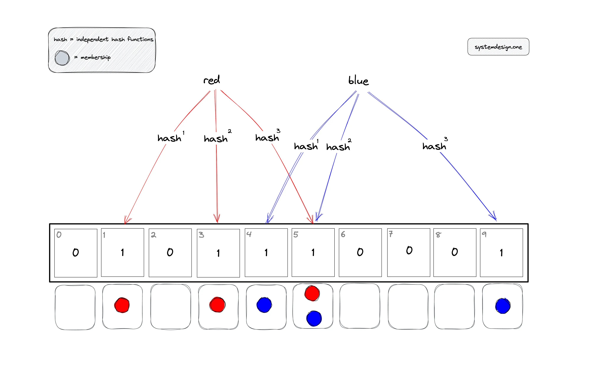
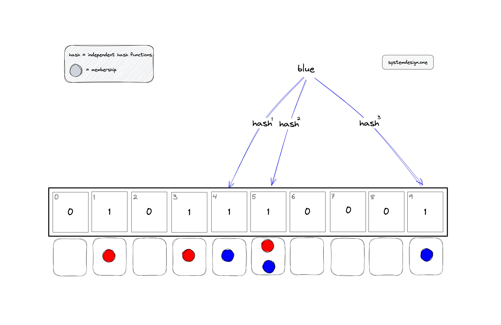
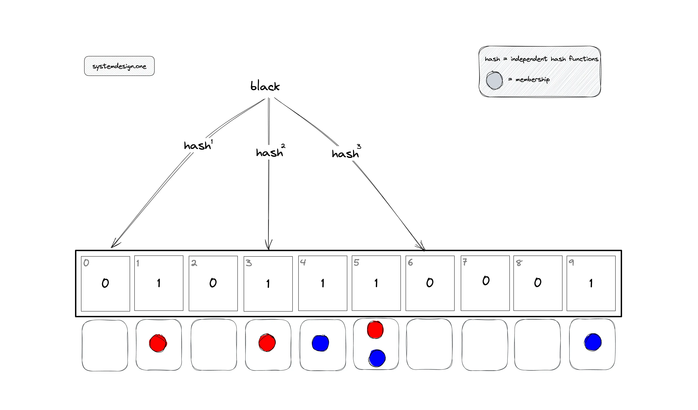
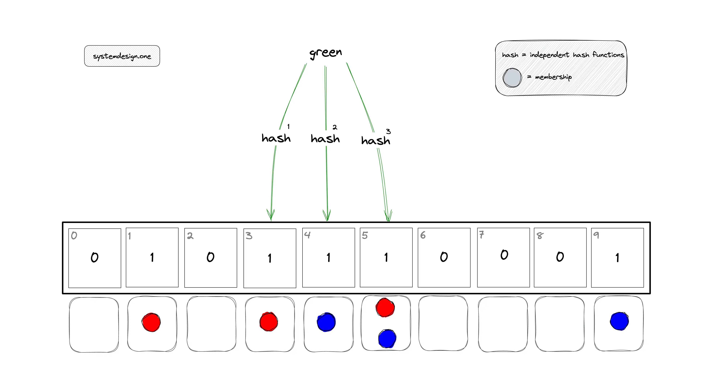

布隆过滤器的原理与 Java 实战
<!-- truncate -->

# 布隆过滤器

## 1. 布隆过滤器是什么

布隆过滤器（Bloom Filter）是一种专门用来检索 “一个元素是否在一个集合中”的概率型数据结构。

它的核心特点是：

* 空间利用率高
* 查询速度快
* 存在一定的误判率
* 不支持删除

## 2. 布隆过滤器的原理

布隆过滤器由一个二进制数组和一系列哈希函数组成。

### 2.1 写入操作流程

当一个元素被加入集合时：

1. 通过 $k$ 个哈希函数对该元素进行计算，得到 $k$ 个哈希值。
2. 将这 $k$ 个哈希值对应的二进制数组下标的值全部置为 **1**。


示例：假设当前有3个哈希函数，二进制数组长度为10，要往布隆过滤器存入“red”、“blue”两个字符串。

首先对`red`用三个哈希函数分别计算哈希值

- `h1(*red*) mod 10 = 1`
- `h2(*red*) mod 10 = 3`
- `h3(*red*) mod 10 = 5`

因此把1、3、5槽位置1。`blue`的插入过程也是同理。



### 2.2 查询操作流程

当查询一个元素是否存在时：

1. 同样通过这 $k$ 个哈希函数计算出 $k$ 个下标。
2. 检查位数组中这 $k$ 个下标的值：
   - **如果有任何一位是 0**：该元素**一定不存在**于集合中。
   - **如果全部位都是 1**：该元素**可能存在**于集合中。


示例：在2.1的示例基础上执行查询操作。

* 查询`blue`是否存在于set中：由于三个hash值对应的下标位都是1，因此认为存在。



* 查询`black`是否存在于set中：由于存在hash值对应的下标位为0的，因为可以确认`black`一定不存在于set中。

  

* 查询`green`是否存在于set中：由于存在哈希冲突，对`green`进行hash结果对应的槽位正好都是1，则会误判为存在。

  


总结：布隆过滤器的查询操作存在误判可能。如果返回为不存在，则一定不存在；如果返回为存在，则可能存在。

### 2.3 不支持删除操作

示例：假设你想删除`blue`元素，则意味着需要将槽4、5、9都置为0。如果将槽5置为0，则查询`red`也会认为不存在。除非你将`blue`删除之后，重新对之前的所有元素执行一次插入操作，这是一个耗时耗性能的操作，所以布隆过滤器不支持删除操作。


## 3. 如何缓解误判问题

我们知道布隆过滤器存在误判问题，判断某个元素存在于集合，实际上可能不存在。那是否可以降低误判率呢？答案是可以的。

### 3.1 误判率是什么

布隆过滤器有一个 $FPP$（False Positive Probability）参数来表示误判率，含义为：当布隆过滤器告诉你某个元素存在，实际上它不存在的概率。

误判率 $FPP$ 与以下三个因子密切相关：

1. $m$：位数组的大小（Bit array size）。
2. $n$：预估存入的元素个数（Number of elements）。
3. $k$：哈希函数的个数（Number of hash functions）。

其经典的近似计算公式为：

$$
FPP \approx (1 - e^{-kn/m})^k
$$


从公式可以看出：

- **位数组 $m$ 越大**，FPP 越低（空间换准确率）。
- **元素个数 $n$ 越多**，FPP 越高（负载越重，冲突越多）。
- **哈希函数 $k$ 的选择**：$k$ 不是越多越好，也不是越少越好，存在一个最优值能使 FPP 最小。

在实际开发（如 Java 中使用 Guava 库或 Redis 插件）中，我们通常不需要手动计算 $m$ 或 $k$，而是采取**结果导向**：

1. **预设 FPP**：开发者根据业务场景指定一个可接受的误判率（例如 $0.01$，即 1%）。
2. **自动推算**：算法库会根据你预期的元素数量 $n$ 和 目标 $FPP$，自动计算出最优的位数组长度 $m$ 和哈希函数个数 $k$。

> **注意：** 误判率永远不可能达到 0。如果你的业务逻辑**绝对不能容忍**任何误判（例如绝对不能给用户发重复的通知），那么布隆过滤器只能作为第一道过滤网，后面必须配合数据库或缓存进行二次精确校验。

### 3.2 如何选择合适的 $FPP$

选择 FPP 需要在 **内存消耗** 和 **准确性** 之间做权衡：

- **1% (0.01)**：工业界常用的平衡点，性能和空间表现都很优秀。
- **0.1% (0.001)**：对准确性要求较高，但需要的内存空间会显著增加（大约是 1% 时的 1.5 倍到 2 倍）。
- **5% 以上**：通常用于对误判极其不敏感，且内存极度受限的场景。

## 4. 布隆过滤器实战

由 Google 开发著名的 Guava 库就提供了布隆过滤器（Bloom Filter）的实现，如果我们在基于Maven的Java项目要使用 Guava 提供的布隆过滤器，只需要引入以下依赖：

```xml
<dependency>
   <groupId>com.google.guava</groupId>
   <artifactId>guava</artifactId>
   <version>28.0-jre</version>
</dependency>
```

下面通过一段代码示例介绍怎么用这个依赖：

1. 创建了一个布隆过滤器，初始插入1000000条数据
2. 查询[0, 1000000+10000]的数据是否存在与布隆过滤器，并统计匹配的数量

```java
public class BloomFilterDemo {
    public static void main(String[] args) {
        int total = 1000000;
        // 创建布隆过滤器对象 参数1：数据类型，参数2：预计插入的数据总量
        BloomFilter<CharSequence> bf = BloomFilter.create(Funnels.stringFunnel(Charsets.UTF_8), total);
        // 插入 total 条数据到过滤器中
        for (int i = 0; i < total; i++) {
            bf.put("" + i);
        }
        // 判断值是否存在过滤器中
        int count = 0;  // 统计匹配数量
        // 判断 total + 10000 条数据是否存在过滤器中
        for (int i = 0; i < total + 10000; i++) {
            if (bf.mightContain("" + i)) {
                count++;
            }
        }
        System.out.println("已匹配数量 " + count);
    }
}
```

输出的结果：

```bash
已匹配数量 1000309
```

理想情况应该是匹配数量只有1000000，但是由于存在误判，所以结果为1000309。

`BloomFilter.create`默认的误判率为0.03。

我们来计算一下是不是真的是0.03，由于误判率计算的是：不在集合中的元素，被判为存在集合中的概率。因此计算方式应该是用`「不在集合中，被判为存在集合中的元素数量」/ 「所有不在集合中的元素数量」 = 309 / 10000 = 0.0309`，所以看到是符合它默认的误判率的。

如果我们想要调低误判率，只需要在创建布隆过滤器的时候传入预期的误判率值即可。

例如我把代码改为如下，省略的代码不变：

```java
public class BloomFilterDemo {
    public static void main(String[] args) {
        // ...
        // 创建布隆过滤器对象 参数1：数据类型，参数2：预计插入的数据总量 参数3：误判率
        BloomFilter<CharSequence> bf = BloomFilter.create(Funnels.stringFunnel(Charsets.UTF_8), total, 0.0002);
        // ...
    }
}
```

输出的结果：

```bash
已匹配数量 1000003
```

`3 / 10000 = 0.0003` 和 `0.0002` 非常接近。

在实际使用中，也不能无尽地将误判率调小，因为误判率越低，消耗的内存也越多，因此需要根据业务需求在误判率和内存空间之间取一个较平衡的值。

## 5. 布隆过滤器应用场景

* 解决缓存穿透问题：检查一个数据是否存在于DB中，先通过布隆过滤器，如果布隆过滤器返回不存在，则一定不存在。由于可能存在误判，因此布隆过滤器无法完全解决缓存穿透问题。
* 垃圾邮件过滤：快速判断一个邮箱地址是否在数十亿级的黑名单中。
* 爬虫 URL 去重： 判断一个网页 URL 是否已经被爬取过，避免重复抓取。