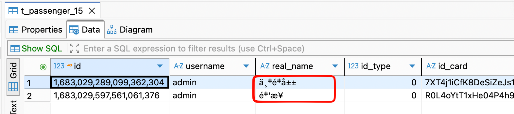
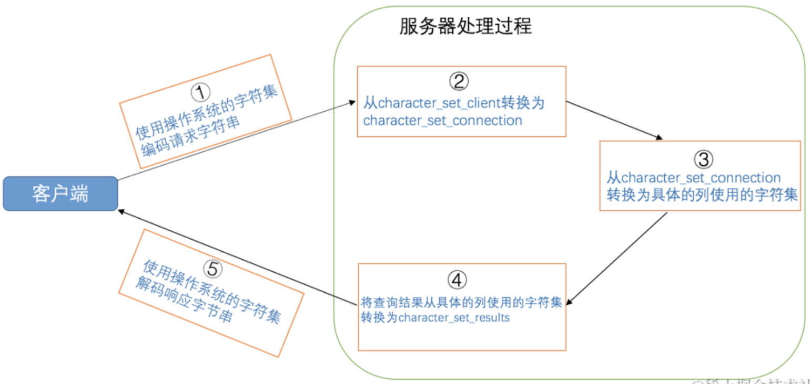
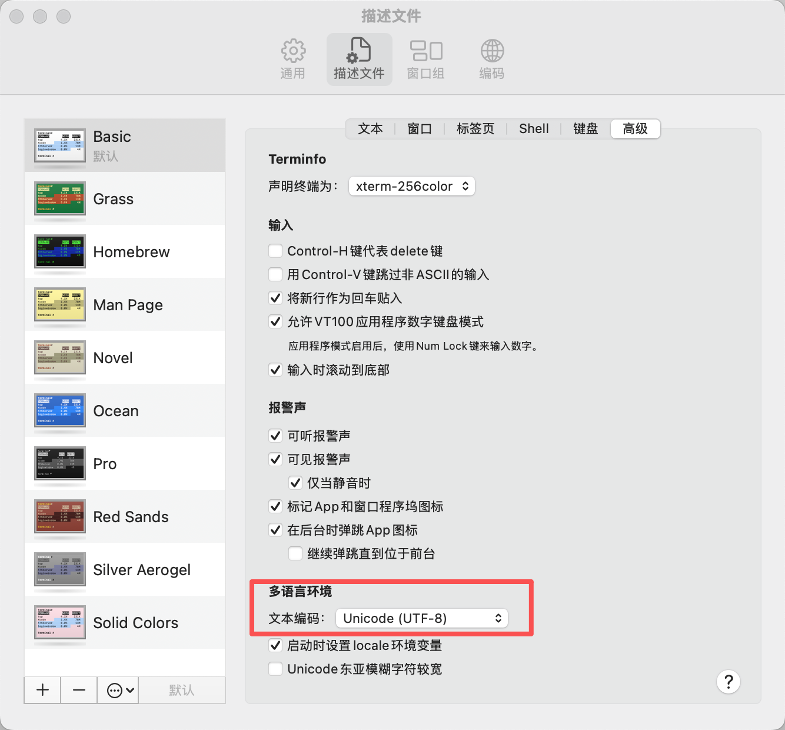
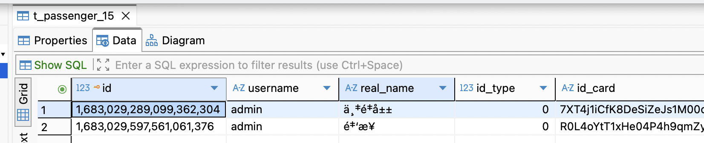
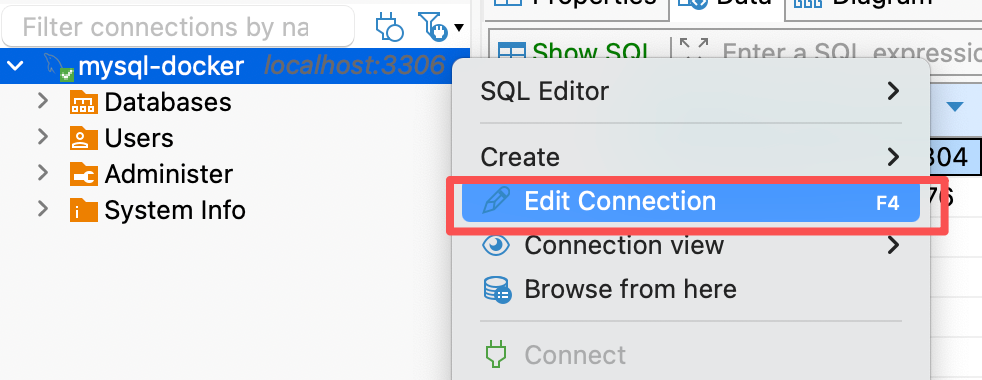
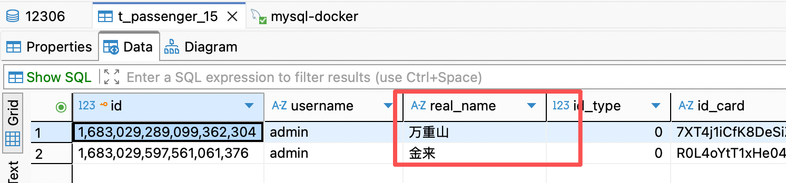

让我带你们彻底终结MySQL乱码问题
<!-- truncate -->

## 一、背景

最近在学习一个新项目，部署过程中涉及到 MySQL 数据库的初始化。项目作者已经提供了完整的 DDL（表结构）和 DML（初始数据）脚本。按照常规逻辑，我只需要在 Docker 中启动 MySQL 容器，创建好数据库，直接导入这些 `.sql` 文件即可。

然而，在看似顺理成章的操作后，我遇到了一个令人头大的问题：**数据库中的中文内容全部变成了乱码。**


## 二、操作复现

为了准确定位问题，我复盘了当时的操作流程：

1. 启动MySQL容器

   ```bash
   docker run --name mysql \
   --platform=linux/amd64 \
   -p 3306:3306 \
   -e MYSQL_ROOT_HOST='%' \
   -e MYSQL_ROOT_PASSWORD=root \
   -d amd64/mysql:5.7.36
   ```

2. 创建数据库

   在terminal执行该命令，进入mysql的交互界面

   ```bash
   docker exec -it mysql mysql -uroot -p
   ```

   手动创建一个名为 `12306` 的数据库，并指定字符集为 `utf8mb4`：

   ```sql
   CREATE DATABASE /*!32312 IF NOT EXISTS*/ `12306` /*!40100 DEFAULT CHARACTER SET utf8mb4 COLLATE utf8mb4_unicode_ci */;
   ```

3. 导入 SQL 脚本

   注意：由于如果我直接在mysql交互界面执行，还需要先将我电脑上的.sql文件cp到docker容器内，我觉得比较麻烦，所以我就重新开了一个terminal，执行下面这个命令，这样就不涉及文件的复制了。

   执行DDL语句

   ```bash
   docker exec -i mysql-Docker mysql -u root -p 12306 < /Users/tudouPotatoo/Developer/JavaCode/12306/resources/db/12306-springboot.sql;
   ```

   执行DML语句

   ``` bash
   docker exec -i mysql mysql -u root -proot --default-character-set=utf8mb4 12306 < /Users/tudouPotatoo/Developer/JavaCode/12306/resources/data/12306-springboot.sql;
   ```

4. 到这里，我们的数据库建好了，表中的数据也插进去了。

   原本以为大功告成，但当我查看表数据时发现，原本 `.sql` 文件中清晰的中文内容，在数据库中全都变成了类似 `äéå±±` 的乱码（如下图所示）。

   

   


## 三、深度探究：乱码背后的真相

> 感觉非常懵，这个时候想起来看《MySQL是怎样运行的》其中一章是讲乱码的，过了一段时间已经忘的差不多了，但是翻翻笔记，能想起个大概，突然感觉之前看的一些东西，总结的一些东西并不是没用的。当然遇到了问题，再回去翻笔记，从而解决问题，又会对之前的知识有新的理解。
>
> 感觉学东西的时候，不要求自己能够完全记住，只要能够完全理解就可以了。以后遇到了相关的问题，翻资料能够马上找到问题的本质然后去解决。
>
> 背是没有必要的，没有人能比大模型记得得更多，关键是理解，从而能够解决问题。
>
> 好，回归正题。


先看看为什么会出现乱码，出现了乱码会是哪里出现问题，应该如何排查。

为什么会出现乱码？

如果客户端用字符集A编码对字符进行编码，而服务端用字符集B对字符进行解码，最终效果就是会出现乱码。

例如：

`我` --- utf8编码 ---> `E68891`（十六进制）

`E68891` --- GBK解码 ---> `鎴?`

<details>
<summary><b>💡 知识插播：字符集与编码的奥秘（点击展开）</b></summary>  


  *看完「为什么会出现乱码？」这个问题的答案之后，不知道屏幕前的你脑袋中会不会有更多的问题冒出来了。*

*ps: 下面的问题跟解决我们的乱码问题没有直接关系，如果想直接看问题的解决方案，可以跳过，按需食用。*

* 问题一：字符集是什么
* 问题二：为什么要有多种不同的字符集
* 问题三：为什么发送方要对字符编码之后，才传给接收方，而不是直接传这个字符给接收方


**回答问题一：字符集是什么？**

我们知道计算机只能存储0和1，那计算机是如何存储字符的呢？就是通过建立字符和二进制数的映射关系。

要建立映射关系需要确认两件事：

1. 字符范围：世界上有这么多字符，要给哪些字符建立映射关系
2. 映射规则：打个比方，a映射为 000，b映射为001，c映射为010...

==***字符集就是某个字符范围的编码规则。***==

例如今天我创建一个我自己的字符集，叫啥好呢，干脆取名为tudou字符集好了。

1. 字符范围：a、b、c、d这四个字符
2. 映射规则：
   * a: 00000000
   * b: 00000001
   * c: 00000010
   * d: 00000011

如果计算机使用tudou字符集，那它底层就是这样存储字符串的，例如：

'ac' -> 00000000 00000010

'bbb' -> 00000001 00000001 00000001


OK，到这里，大家已经明白了字符集是什么：某个字符范围的编码规则。

那我们顺便再介绍一下常见的字符集，来加深一下对字符集的理解：

* `ASCII`字符集

  - 共收录128个字符，包括空格、标点符号、**数字**、**大小写字母**和一些不可见字符。

  - 使用1个字节来进行编码。

  - 我们看一些字符的编码方式：

    ```
    'L' ->  01001100（十六进制：0x4C，十进制：76）
    'M' ->  01001101（十六进制：0x4D，十进制：77）
    ```


* `ISO 8859-1`字符集（别名`latin1`）

  - 共收录256个字符，是在`ASCII`字符集的基础上又扩充了128个西欧常用字符(包括德法两国的字母)

  - 使用1个字节来进行编码。


* `utf8`字符集

  - 收录地球上能想到的所有字符，而且还在不断扩充。

  - 这种字符集兼容`ASCII`字符集，采用变长编码方式，编码一个字符需要使用1～4个字节。

  - 准确的说，utf8只是Unicode字符集的一种编码方案，Unicode字符集可以采用utf8、utf16、utf32这几种编码方案，utf8使用1～4个字节编码一个字符，utf16使用2个或4个字节编码一个字符，utf32使用4个字节编码一个字符。

  - 由于常用的字符使用1-3个字节表示就足够了，MySQL为了性能考虑，定义了utfmb3和utfmb4：

    - `utf8mb3`：阉割过的`utf8`字符集，只使用1～3个字节表示字符。

    - `utf8mb4`：正宗的`utf8`字符集，使用1～4个字节表示字符。

      在MySQL中`utf8`是`utf8mb3`的别名。（现在MySQL已经趋向于推荐大家使用utf8mb4）


**回答问题二：为什么要有多种不同的字符集？**

为什么要有多种不同的字符集，用一种统一的字符集不就好了？

一开始计算机是由美国人发明的，由于英语只需要表示26个英文字母以及数字等等，字符比较少，因此美国人用ASCII编码，每个字符用一个字节即可表示。

后来美国以外的其他国家计算机也发展起来了，为了能够表示自己的语言，中国推出了`GB2312`字符集，在ASCII字符集的基础上收录了汉字等字符。西欧推出了latin1，在ASCII字符集的基础上收录了128个西欧常用字符(包括德法两国的字母)。

所以其实有多种字符集其实是历史遗留原因。

现在大部分应用使用的都是UTF-8字符集，因为UTF-8兼容全球语言。


**回答问题三：为什么发送方要对字符编码之后，才传给接收方，而不是直接传这个字符给接收方？**

因为数据是通过电信号传播的，电信号只有两种0和1，我们必须要将字符转化为01编码，才能够通过电信号传播给对方。

字符 -->  二进制 这个过程就是所谓的编码过程

二进制 -->  字符 这个过程就是所谓的解码过程

为了保证接收方能够正确从二进制转化为字符，接收方和发送方使用的字符集必须要一致。

如果不一致，就会出现乱码问题。

</details>


## 四、乱码排错实战

既然理论上乱码源于「编解码字符集不一致」，那我们就来验证一下，在我的 MySQL 环境里，这个「不一致」到底发生在哪个环节。

### 4.1 关键知识

在这之前，还需要介绍一下MySQL客户端和服务端交互的过程中字符集是如何变化的，这个过程涉及下面三个系统变量：

| 系统变量                   | 描述                                                         |
| -------------------------- | ------------------------------------------------------------ |
| `character_set_client`     | 服务器解码客户端发来的请求时使用的字符集                     |
| `character_set_connection` | 服务器处理请求时会把请求字符串从`character_set_client`转为`character_set_connection` |
| `character_set_results`    | 服务器向客户端返回数据时使用的字符集                         |

以客户端发送`SELECT * FROM t WHERE s = '我';`请求为例介绍

1. 客户端将整个请求字符串进行编码，发送给服务端

   客户端使用的字符集和客户端OS相关，如下：

   - 类`Unix`系统使用的是`utf8`
   - `Windows`使用的是`gbk`

2. 服务端接收到二进制形式的请求，它会认为这个二进制字节采用的是character_set_client对应的字符集编码，因此服务端会以相同的字符集进行解码。

   然后服务端会以character_set_connection字符集进行编码

3. 如果s列使用的字符集和character_set_connection字符集不一致，则还需要转换为s列使用的字符集

4. 执行查询操作

5. 查询到结果之后，会将结果从s列使用的字符集解码，用character_set_results字符集编码发送给客户端

6. 最后客户端再对结果进行解码



99%的情况下，这三个系统变量都是完全一样的值，只有及其少数的情况下是不一样的。


### 4.2 盘点“案发现场”的配置

我们现在已经知道了MySQL客户端和服务端交互的过程中字符集是如何变化的，那我们可以看看客户端和服务端使用的字符集是否不同，从而导致的乱码。

我们先来“对账”，看看客户端和服务端分别在用什么：

* 服务端

  使用`SHOW VARIABLES LIKE 'character_set_%;'`命令，看一下MySQL Server这三个系统变量的值：


​	可以看到，都是latin1。

* 客户端

  我的电脑默认使用的是UTF-8字符集，在macOS中，你可以通过locale命令来看使用的字符集。

  ```bash
  (base) tudouPotatoo@tudouPotatoodeMacBook-Air ~ % locale
  LANG="zh_CN.UTF-8"
  LC_COLLATE="zh_CN.UTF-8"
  LC_CTYPE="zh_CN.UTF-8"
  LC_MESSAGES="zh_CN.UTF-8"
  LC_MONETARY="zh_CN.UTF-8"
  LC_NUMERIC="zh_CN.UTF-8"
  LC_TIME="zh_CN.UTF-8"
  LC_ALL=
  ```

  也可以通过打开terminal，点击终端-->设置-->描述文件-->高级 拉到最下面，看到多语言环境部分的文本编码，也可以看到使用的编码方式。

  


### 4.3 深度还原：一条数据的“受难记”

**我们分析一下插入一条数据，整个编码解码流程。**我们以插入 `real_name` 为 **“万重山”** 的这条数据为例，看看它在传输过程中是如何被一步步搞“糊”的：

插入数据的DML命令是下面这样的

```sql
INSERT INTO `t_passenger_15` (`id`, `username`, `real_name`, `id_type`, `id_card`, `discount_type`, `phone`,
                              `create_date`, `verify_status`, `create_time`, `update_time`, `del_flag`)
VALUES (1683029289099362304, 'admin', '万重山', 0, '7XT4j1iCfK8DeSiZeJs1M00oDOG/KxdBXKR34j5YLZc=', 0,
        'MZObk+5TeYPLHtP2A6+aiw==', '2023-07-23 16:20:26', 0, '2023-07-23 16:20:26', '2023-07-23 16:20:26', 0),
```

*在分析这段 SQL 语句时，我发现除了‘万重山’这三个中文字符外，其余内容（如 `INSERT`、`VALUES`、数字和标点）均属于 **ASCII 字符集**。由于现代主流字符集（如 UTF-8、GBK、Latin1）在设计上都**向下兼容 ASCII**（即对于前 128个字符，它们的编码字节完全相同），这意味着即便编码和解码的字符集不匹配，这些英文字符也不会出现乱码。因此，我们可以暂时忽略这些‘安全’的 ASCII 字符，将目光聚焦在受灾区——‘万重山’这三个中文字符上，它们才是揭开编解码错位真相的关键。*


第一阶段：客户端发出请求

我的Mac终端在给mysql server发送命令之前，会通过utf8给命令进行编码。

“万重山”三个字就变成了下面这样

```sql
E4 B8 87 E9 87 8D E5 B1 B1
```


第二阶段：服务端接收与解码

mysql server接收到之后，它认为客户端使用的是latin1（character_set_client系统变量）来编码，因此也用latin1解码，解码之后得到下面的内容。这些实际上都是latin1字符集的西欧字符，但我们看不懂，就称为乱码。

`万重山`


第三阶段：中间转换与入库

服务器将这些西欧字符再用latin1（character_set_connection系统变量）来编码，由于real_name列使用的是utf8mb4字符集，因此从latin1字符集转为utf8mb4字符集。即先用latin1解码，再用utf8mb4编码，然后存入DB中。


总结一下，**DB存储的是`万重山`这些乱码的utf8mb4形式。数据库存的就是乱码，数据库存的就是脏数据！**


### 4.4 数据读取的过程

**那在DBeaver查询的过程是咋样的？**

其实我们打开下面这个页面，它本质就是执行了`SELECT * FROM t_passenger_15;`这个命令，我们继续分析一下`SELECT * FROM t_passenger_15`这个sql语句运行过程。



我们用DBeaver连接数据库的时候，它其实会做这样一件事情：

右键这个数据库连接



找到characterEncoding，这指定了DBeaver使用的字符集。


**DBeaver在（通过 JDBC 驱动）连接建立时，会自动执行`SET NAMES utf8mb4`**（在DBeaver，utf-8 = utf8mb4）

那相当于`character_set_client`、`character_set_connection`、`character_set_result`全都被统一设为了 `utf8mb4`。

**数据读取的链路分析：**

1. 服务端取数：MySQL Server 从磁盘读取 real_name 列的内容。由于该列已经是 utf8mb4 编码，且要求的 character_set_results 也是 utf8mb4，服务器不会进行任何转换，直接将字节流原样返回。

2. 客户端解码：DBeaver 接收到这串原始字节流，按照既定的 utf8mb4 规则进行解码。

3. 最终呈现：因为数据库里存的原本就是那串“西欧乱码字节”，DBeaver 忠实地将其解了出来。所以，你在屏幕上看到了诸如`万重山`的乱码。


<details>
  <summary><b>趣味发现：CLI 里的“负负得正”魔法</b></summary>  

在分析完 DBeaver 的乱码后，我很好奇：如果不用图形化工具，直接在终端交互窗口（即 `mysql -uroot -p` 进入的 CLI）执行 `SELECT`，会发生什么？

令人意外的结果出现了：**在终端里，中文居然显示正常了！**

明明数据库里存的是乱码，为什么客户端反而能读到正确的字符？经过推导，我发现这其实是一个**“负负得正”**的巧合。


我们要先记住，此时数据库里存的已经是经过“错误解码”后的西欧字符乱码了。

**CLI读取时的链路转换**

当我们执行查询时，MySQL CLI 经历了一个极其曲折的变换过程：

**取数**：从磁盘读出 utf8mb4 格式的“脏字节”。

**解码**：服务端由于 character_set_results 是 latin1，它会尝试用 latin1 对这些字节进行编码。

**传输**：将编码后的字节流发送给客户端。

**终端呈现**：我的 macOS 终端本身是 UTF-8。当它收到字节流后，会尝试用 UTF-8 进行最后一次解码。


如果我们剥离掉中间繁杂的步骤，整个生命周期就像这样：

万重山 → (UTF-8 编码) → (Latin1 解码) → [ 存于 DB 的脏数据 ] > → (Latin1 编码) → (终端 UTF-8 解码) → 万重山

真相大白：正是因为入库时多了一次错误的 Latin1 解码，而读取显示时又恰好经过了一次 Latin1 编码还原和 UTF-8 解码，这两层错误竟然完美抵消了！

也就是说，如果用mysql交互式命令窗口，执行`SELECT * FROM t_passenger_15;`

能够读到正确的中文


虽然数据库存的是乱码，客户端依然能读到正确的字符，很有意思哈哈哈


虽然这种“负负得正”让中文在终端里看起来是正常的，但这其实掩盖了数据库中数据早已损坏的事实。一旦你换一个客户端环境（比如换到 Windows 的 GBK 环境）来读数据库的数据，就不会生效。

</details>


### 4.5 拨乱反正：彻底告别乱码

**我们现在知道了问题产生的原因：mysql client用utf8编码，mysql server用latin1解码，得到了乱码，导致存在数据库中的就是乱码。**

那如何解决这个问题呢？答案：让mysql client和mysql server使用的字符集保持一致。

现在macOS默认就是使用utf8（在macOS，utf-8 = utf8mb4）编码方式，那我们可以让mysql server也使用utf8mb4字符集，有很多种做法：

* 做法1：改变SESSION范围（character_set_client、character_set_connection、character_set_result）这三个系统变量的值

  >  这种做法仅对当前连接生效

  下面四种方式效果完全一致。

  ```sql
  SET NAMES 字符集名;
  ```

  或

  ```sql
  SET character_set_client = 字符集名;
  SET character_set_connection = 字符集名;
  SET character_set_results = 字符集名;
  ```

  或

  ```sql
  SET SESSION character_set_client = 字符集名;
  SET SESSION character_set_connection = 字符集名;
  SET SESSION character_set_results = 字符集名;
  ```

  或

  连接数据库的时候加上下面这个参数

  ```sql
  --default-character-set=utf8mb4
  /* mysql -u root -proot --default-character-set=utf8mb4 */
  /* 当你使用 --default-character-set=utf8mb4 启动 MySQL 客户端并成功登录后，
  	 客户端会自动发送一条 SET NAMES utf8mb4 给服务器。 */
  ```

* 做法2：改变GLOBAL范围（character_set_client、character_set_connection、character_set_result）这三个系统变量的值

  > 这种做法仅对后续新创建的连接生效，不影响已有的连接

  ```sql
  SET GLOBAL character_set_client = 字符集名;
  SET GLOBAL character_set_connection = 字符集名;
  SET GLOBAL character_set_results = 字符集名;
  ```

* 做法3：永久改变

  上面的做法1、2都是临时性的，如果要修改默认配置，而不是每次都执行这些命令，可以直接修改mysql的配置文件`my.cnf` (macOS/Linux) 或 `my.ini` (Windows)：

  ```sql
  # 影响 mysql 命令行客户端
  # 所有连接 MySQL 的本地程序（比如 mysql 命令行、mysqldump 备份工具、mysqlcheck 修复工具）都会先读取这里的设置。
  [client]
  # 作用：和服务端连接成功就执行SET NAMES utf8mb4
  # 既是“声明”，也是“指令”。
  # 声明层面：就是和mysql server建立连接的时候告诉mysql server，我发送过来的数据都是utf8mb4编码的，你也用这个字符集来处理吧。
  # 指令层面：当client从终端接收到数据之后，如果发现数据不是utf8mb4编码，会先转成utf8mb4编码，然后再发给server。例如如果终端使用的是ascii编码，则client接收到之后会先转化为utf8mb4编码。
  default-character-set = utf8mb4
  
  
  # 影响 mysql 客户端默认行为
  # 专指 mysql 交互式命令行窗口（就是在终端输入 mysql -u root -p 进去的那个）。
  # 它继承并细化了 [client]。如果这里不设，它会用 [client] 的。
  # 专门写出来是为了方便给命令行窗口做个性化（比如定义命令提示符格式、开启自动补全等）。
  [mysql]
  default-character-set = utf8mb4
  
  # 影响服务器端默认行为
  [mysqld]
  # 指定服务器默认使用的字符集
  # 当你执行 CREATE DATABASE 或 CREATE TABLE 而没有手动指定字符集时，MySQL 就会自动使用这个配置的值作为默认值。
  character-set-server = utf8mb4
  # 指定服务器默认使用的排序规则
  collation-server = utf8mb4_unicode_ci
  ```

  三个地方都指定，保证整个链路上的编码方式是一致的，就不会出现乱码问题。


**验证生效：**修改了之后，可以使用`SHOW VARIABLES LIKE 'character_set_%';`这个命令校验一下是否生效。


### 4.6 实战演练：验证修复方案

上面都是理论，我们直接来实践一下，按上述的方法是不是真的可以生效。

**“病况”：**

* 现在数据库中存的中文在DBeaver中显示的都是乱码

  

* 操作系统macOS，默认使用utf8mb4字符集

* 数据库的character_set_client、character_set_connection、character_set_results都是latin1。

  ```sql
  mysql> use 12306
  Database changed
  mysql> SHOW VARIABLES LIKE 'character_set_%';
  +--------------------------+----------------------------+
  | Variable_name            | Value                      |
  +--------------------------+----------------------------+
  | character_set_client     | latin1                     |
  | character_set_connection | latin1                     |
  | character_set_database   | utf8mb4                    |
  | character_set_filesystem | binary                     |
  | character_set_results    | latin1                     |
  | character_set_server     | latin1                     |
  | character_set_system     | utf8                       |
  | character_sets_dir       | /usr/share/mysql/charsets/ |
  +--------------------------+----------------------------+
  8 rows in set (0.00 sec)
  ```

  

我们用4.5讨论做法实践一下

#### 做法1方式1

改变SESSION范围（character_set_client、character_set_connection、character_set_result）这三个系统变量的值

```sql
SET NAMES 字符集名;
```


1. drop掉12306这个数据库
2. 执行`SET NAMES utf8mb4;`
3. 创建12306这个数据库
4. 执行`source tmp/db.sql;`和`source tmp/data.sql;`

```sql
# drop掉12306这个数据库
mysql> DROP DATABASE `12306`;
Query OK, 140 rows affected (0.19 sec)

# 执行`SET NAMES utf8mb4;`
mysql> SET NAMES utf8mb4;
Query OK, 0 rows affected (0.00 sec)

# 创建12306这个数据库
mysql> CREATE DATABASE /*!32312 IF NOT EXISTS*/ `12306` /*!40100 DEFAULT CHARACTER SET utf8mb4 COLLATE utf8mb4_unicode_ci */;
Query OK, 1 row affected (0.00 sec)

# 验证系统变量
mysql> SHOW VARIABLES LIKE 'character_set_%';
+--------------------------+----------------------------+
| Variable_name            | Value                      |
+--------------------------+----------------------------+
| character_set_client     | utf8mb4                    |
| character_set_connection | utf8mb4                    |
| character_set_database   | latin1                     |
| character_set_filesystem | binary                     |
| character_set_results    | utf8mb4                    |
| character_set_server     | latin1                     |
| character_set_system     | utf8                       |
| character_sets_dir       | /usr/share/mysql/charsets/ |
+--------------------------+----------------------------+
8 rows in set (0.00 sec)

mysql> use 12306;
Database changed

# 执行DDL.sql（这里我提前将.sql文件cp进docker容器）
mysql> source tmp/db.sql;
Query OK, 0 rows affected (0.01 sec)

Query OK, 0 rows affected (0.00 sec)

Query OK, 0 rows affected (0.00 sec)
...
Query OK, 0 rows affected (0.00 sec)

# 执行DML.sql
mysql> source tmp/data.sql;
Query OK, 2 rows affected (0.00 sec)
Records: 2  Duplicates: 0  Warnings: 0

Query OK, 1 row affected (0.01 sec)

Query OK, 64 rows affected (0.00 sec)
Records: 64  Duplicates: 0  Warnings: 0
...
Query OK, 480 rows affected (0.01 sec)
Records: 480  Duplicates: 0  Warnings: 0

mysql> 

```


我们用DBeaver查看数据，现在可以正常展示中文。


#### 做法1方式2

我们试一下用这种方式

```sql
SET character_set_client = 字符集名;
SET character_set_connection = 字符集名;
SET character_set_results = 字符集名;
```

1. drop掉12306这个数据库

2. 新打开一个terminal，用`mysql -u root -proot`这个命令连接mysql server

3. 执行下面这三个命令

   ```sql
   SET character_set_client = utf8mb4;
   SET character_set_connection = utf8mb4;
   SET character_set_results = utf8mb4;
   ```

4. 创建12306这个数据库

5. 执行`source tmp/db.sql;`和`source tmp/data.sql;`

6. 在DBeaver查看表数据--->中文正常展示

   

7. 新开一个terminal，用`mysql -u root -proot`这个命令连接mysql server

8. 创建12307表

9. 执行`source tmp/db.sql;`和`source tmp/data.sql;`

10. 在DBeaver查看表数据--->中文显示乱码

    

11. **可以看出这三个命令确实只是SESSION级别生效**


#### 做法1方式3

做法1还有一种方式，我们也来试试，`mysql -u root -proot --default-character-set=utf8mb4` 用这个命令来连接mysql server。

1. drop掉12306这个数据库
2. 新打开一个terminal，用`mysql -u root -proot --default-character-set=utf8mb4`这个命令连接mysql server
3. 创建12306这个数据库
4. 执行`source tmp/db.sql;`和`source tmp/data.sql;`

```sql
# drop掉12306这个数据库
mysql> DROP DATABASE `12306`;
Query OK, 140 rows affected (0.18 sec)
```

```sql
# 新打开一个terminal，用`mysql -u root -proot --default-character-set=utf8mb4`这个命令连接mysql server
(base) tudouPotatoo@tudouPotatoodeMacBook-Air ~ % docker exec -it mysql mysql -u root -proot --default-character-set=utf8mb4 
mysql: [Warning] Using a password on the command line interface can be insecure.
Welcome to the MySQL monitor.  Commands end with ; or \g.
Your MySQL connection id is 48
Server version: 5.7.36 MySQL Community Server (GPL)

Copyright (c) 2000, 2021, Oracle and/or its affiliates.

Oracle is a registered trademark of Oracle Corporation and/or its
affiliates. Other names may be trademarks of their respective
owners.

Type 'help;' or '\h' for help. Type '\c' to clear the current input statement.

# 创建12306这个数据库
mysql> CREATE DATABASE /*!32312 IF NOT EXISTS*/ `12306` /*!40100 DEFAULT CHARACTER SET utf8mb4 COLLATE utf8mb4_unicode_ci */;
Query OK, 1 row affected (0.01 sec)

mysql> use 12306;
Database changed

# 执行`source tmp/db.sql;`和`source tmp/data.sql;`
mysql> source tmp/db.sql;
Query OK, 0 rows affected (0.01 sec)

Query OK, 0 rows affected (0.00 sec)

Query OK, 0 rows affected (0.00 sec)
...
Query OK, 0 rows affected (0.00 sec)

mysql> source tmp/data.sql;
Query OK, 2 rows affected (0.00 sec)
Records: 2  Duplicates: 0  Warnings: 0

Query OK, 1 row affected (0.01 sec)

Query OK, 64 rows affected (0.00 sec)
Records: 64  Duplicates: 0  Warnings: 0
...
Query OK, 480 rows affected (0.01 sec)
Records: 480  Duplicates: 0  Warnings: 0

mysql> 

```

完毕，用DBeaver查看数据依然能够正常显示中文




#### 做法2

做法2我们就不进行演示了，和做法1是非常类似的。


#### 做法3

接下来实践一下做法3，修改mysql的配置文件。

首先我们先看一下原本的mysql配置文件长啥样。

1. 进入docker容器的交互式终端

   ```sql
   (base) tudouPotatoo@tudouPotatoodeMacBook-Air ~ % docker exec -it mysql bash
   ```

2. 一般来说，MySQL配置文件位于`/etc/mysql/my.cnf`这个位置，我们cat一下

   ```sql
   (base) tudouPotatoo@tudouPotatoodeMacBook-Air ~ % docker exec -it mysql bash
   root@5737b5b11c07:/# cat /etc/mysql/my.cnf
   # Copyright (c) 2016, 2021, Oracle and/or its affiliates.
   #
   # This program is free software; you can redistribute it and/or modify
   # it under the terms of the GNU General Public License, version 2.0,
   # as published by the Free Software Foundation.
   #
   # This program is also distributed with certain software (including
   # but not limited to OpenSSL) that is licensed under separate terms,
   # as designated in a particular file or component or in included license
   # documentation.  The authors of MySQL hereby grant you an additional
   # permission to link the program and your derivative works with the
   # separately licensed software that they have included with MySQL.
   #
   # This program is distributed in the hope that it will be useful,
   # but WITHOUT ANY WARRANTY; without even the implied warranty of
   # MERCHANTABILITY or FITNESS FOR A PARTICULAR PURPOSE.  See the
   # GNU General Public License, version 2.0, for more details.
   #
   # You should have received a copy of the GNU General Public License
   # along with this program; if not, write to the Free Software
   # Foundation, Inc., 51 Franklin St, Fifth Floor, Boston, MA  02110-1301 USA
   
   !includedir /etc/mysql/conf.d/
   !includedir /etc/mysql/mysql.conf.d/
   ```

   看my.cnf配置文件可以看到，这里没有任何的配置信息。

   最后的`!includedir /etc/mysql/conf.d/` 和`!includedir /etc/mysql/mysql.conf.d/`这两行含义为：请去这两个文件夹里寻找所有以 `.cnf` 结尾的文件，并把它们的内容全部加载进来。

   所以真正的配置信息在这两个路径下

3. 查看这两个路径下的信息

   ```bash
   root@5737b5b11c07:/# cd /etc/mysql/conf.d/
   root@5737b5b11c07:/etc/mysql/conf.d# ls
   docker.cnf  mysql.cnf  mysqldump.cnf
   root@5737b5b11c07:/etc/mysql/conf.d# cat mysql.cnf
   [mysql]
   ```

   ```bash
   root@5737b5b11c07:/etc/mysql/conf.d# cd /etc/mysql/mysql.conf.d/
   root@5737b5b11c07:/etc/mysql/mysql.conf.d# ls
   mysqld.cnf
   root@5737b5b11c07:/etc/mysql/mysql.conf.d# cat mysqld.cnf
   # Copyright (c) 2014, 2021, Oracle and/or its affiliates.
   #
   # This program is free software; you can redistribute it and/or modify
   # it under the terms of the GNU General Public License, version 2.0,
   # as published by the Free Software Foundation.
   #
   # This program is also distributed with certain software (including
   # but not limited to OpenSSL) that is licensed under separate terms,
   # as designated in a particular file or component or in included license
   # documentation.  The authors of MySQL hereby grant you an additional
   # permission to link the program and your derivative works with the
   # separately licensed software that they have included with MySQL.
   #
   # This program is distributed in the hope that it will be useful,
   # but WITHOUT ANY WARRANTY; without even the implied warranty of
   # MERCHANTABILITY or FITNESS FOR A PARTICULAR PURPOSE.  See the
   # GNU General Public License, version 2.0, for more details.
   #
   # You should have received a copy of the GNU General Public License
   # along with this program; if not, write to the Free Software
   # Foundation, Inc., 51 Franklin St, Fifth Floor, Boston, MA  02110-1301 USA
   
   #
   # The MySQL  Server configuration file.
   #
   # For explanations see
   # http://dev.mysql.com/doc/mysql/en/server-system-variables.html
   
   [mysqld]
   pid-file	= /var/run/mysqld/mysqld.pid
   socket		= /var/run/mysqld/mysqld.sock
   datadir		= /var/lib/mysql
   #log-error	= /var/log/mysql/error.log
   # By default we only accept connections from localhost
   #bind-address	= 127.0.0.1
   # Disabling symbolic-links is recommended to prevent assorted security risks
   symbolic-links=0
   root@5737b5b11c07:/etc/mysql/mysql.conf.d# 
   ```

   汇总一下，配置信息就是下面这样：

   ```ini
   [mysql]
   [mysqld]
   pid-file	= /var/run/mysqld/mysqld.pid
   socket		= /var/run/mysqld/mysqld.sock
   datadir		= /var/lib/mysql
   #log-error	= /var/log/mysql/error.log
   # By default we only accept connections from localhost
   #bind-address	= 127.0.0.1
   # Disabling symbolic-links is recommended to prevent assorted security risks
   symbolic-links=0
   ```

   所以实际上，是没有配置任何和字符集相关的信息的。

   没有配置，就会使用默认值。

   * **MySQL 5.7 及以下版本**：默认是 `latin1`。如果存中文，必乱码。

   * **MySQL 8.0 及以上版本**：默认是 `utf8mb4`。这是现代标准，支持中文和 Emoji，通常不需要额外配置。

   我们这里使用的MySQL版本正好是5.7版本，因此就是默认使用`latin1`字符集。

   ```properties
   root@5737b5b11c07:/etc/mysql/mysql.conf.d# mysql --version
   mysql  Ver 14.14 Distrib 5.7.36, for Linux (x86_64) using  EditLine wrapper
   ```

   也就解释了为什么一开始执行`SHOW VARIABLES LIKE 'character_set_%';`，`character_set_client`、`character_set_connection`和`character_set_results`这三个系统变量的值是latin1。

   ```sql
   mysql> SHOW VARIABLES LIKE 'character_set_%';
   +--------------------------+----------------------------+
   | Variable_name            | Value                      |
   +--------------------------+----------------------------+
   | character_set_client     | latin1                     |
   | character_set_connection | latin1                     |
   | character_set_database   | utf8mb4                    |
   | character_set_filesystem | binary                     |
   | character_set_results    | latin1                     |
   | character_set_server     | latin1                     |
   | character_set_system     | utf8                       |
   | character_sets_dir       | /usr/share/mysql/charsets/ |
   +--------------------------+----------------------------+
   8 rows in set (0.00 sec)
   ```

   

我们现在已经看到了原本的配置文件是长啥样，我们希望改成这样：

```sql
[client]
default-character-set = utf8mb4

[mysql]
default-character-set = utf8mb4

[mysqld]
character-set-server = utf8mb4
collation-server = utf8mb4_unicode_ci
```


**做法如下：**

1. 在宿主机创建一个`my-custom.cnf`文件

   内容为

   ```ini
   [client]
   default-character-set = utf8mb4
   
   [mysql]
   default-character-set = utf8mb4
   
   [mysqld]
   character-set-server = utf8mb4
   collation-server = utf8mb4_unicode_ci
   ```

2. 将文件复制到docker mysql里面

   ```bash
   docker cp /Users/tudouPotatoo/Developer/pre-blog/file/my-custom.cnf 5737b5b11c07:/etc/mysql/conf.d/
   ```

   为啥是复制到/etc/mysql/conf.d/这个路径，就是因为我们`cat /etc/mysql/my.cnf`配置文件看到mysql是从`/etc/mysql/conf.d/`这个路径加载`.cnf`类型的文件作为配置。

3. 让配置生效，restart一下容器

   ```bash
   docker restart mysql
   ```

4. 可以检查一下是否复制进去了

   ```bash
   (base) tudouPotatoo@tudouPotatoodeMacBook-Air ~ % docker exec -it mysql bash
   root@5737b5b11c07:/# cd /etc/mysql/conf.d/
   root@5737b5b11c07:/etc/mysql/conf.d# ls
   docker.cnf  my-custom.cnf  mysql.cnf  mysqldump.cnf
   root@5737b5b11c07:/etc/mysql/conf.d# cat my-custom.cnf 
   [client]
   default-character-set = utf8mb4
   
   [mysql]
   default-character-set = utf8mb4
   
   [mysqld]
   character-set-server = utf8mb4
   collation-server = utf8mb4_unicode_ci
   ```

5. 进入mysql交互页，检查配置是否生效

   ```bash
   (base) tudouPotatoo@tudouPotatoodeMacBook-Air ~ % docker exec -it mysql mysql -uroot -p
   Enter password: 
   Welcome to the MySQL monitor.  Commands end with ; or \g.
   Your MySQL connection id is 2
   Server version: 5.7.36 MySQL Community Server (GPL)
   
   Copyright (c) 2000, 2021, Oracle and/or its affiliates.
   
   Oracle is a registered trademark of Oracle Corporation and/or its
   affiliates. Other names may be trademarks of their respective
   owners.
   
   Type 'help;' or '\h' for help. Type '\c' to clear the current input statement.
   
   mysql> show variables like "char%";
   +--------------------------+----------------------------+
   | Variable_name            | Value                      |
   +--------------------------+----------------------------+
   | character_set_client     | utf8mb4                    |
   | character_set_connection | utf8mb4                    |
   | character_set_database   | utf8mb4                    |
   | character_set_filesystem | binary                     |
   | character_set_results    | utf8mb4                    |
   | character_set_server     | utf8mb4                    |
   | character_set_system     | utf8                       |
   | character_sets_dir       | /usr/share/mysql/charsets/ |
   +--------------------------+----------------------------+
   8 rows in set (0.02 sec)
   
   ```

   可以看到`character_set_client`、`character_set_connection`、`character_set_results`这些配置的值都是utf8mb4。生效了！

6. 新开一个terminal，把之前测试的12306、12307数据库都drop掉，重新建库，重新执行`.sql`文件

   ```sql
   mysql> DROP DATABASE `12306`;
   Query OK, 140 rows affected (0.20 sec)
   
   mysql> DROP DATABASE `12307`;
   Query OK, 140 rows affected (0.18 sec)
   
   mysql> CREATE DATABASE /*!32312 IF NOT EXISTS*/ `12306` /*!40100 DEFAULT CHARACTER SET utf8mb4 COLLATE utf8mb4_unicode_ci */;
   Query OK, 1 row affected (0.01 sec)
   
   mysql> use 12306;
   Database changed
   
   mysql> source tmp/db.sql;
   Query OK, 0 rows affected (0.01 sec)
   
   Query OK, 0 rows affected (0.00 sec)
   
   Query OK, 0 rows affected (0.00 sec)
   ...
   Query OK, 0 rows affected (0.00 sec)
   
   mysql> source tmp/data.sql;
   Query OK, 2 rows affected (0.00 sec)
   Records: 2  Duplicates: 0  Warnings: 0
   
   Query OK, 1 row affected (0.01 sec)
   
   Query OK, 64 rows affected (0.00 sec)
   Records: 64  Duplicates: 0  Warnings: 0
   ...
   Query OK, 480 rows affected (0.01 sec)
   Records: 480  Duplicates: 0  Warnings: 0
   
   mysql> 
   
   ```

7. 中文能够正确显示，成功！

   


## 五、总结

上面讨论了很多很多：

1. 讨论了字符集是什么
2. 讨论了为什么要有多种字符集
3. 讨论了为什么发送方要对字符编码之后，才传给接收方，而不是直接传这个字符给接收方
4. 讨论了为什么会出现乱码
5. 讨论了MySQL客户端和服务端交互的过程中字符集是如何变化的
6. 讨论了如何修改MySQL使用的字符集（SESSION范围、GLOBAL范围、永久改变）
7. ...


回顾这次折腾的经历，我们不仅解决了一个报错，更完整梳理了 MySQL 字符集的底层逻辑：

- **理清了本质**：字符集是某个字符范围的编码规则，乱码的根源永远是**编解码格式的不对称**。
- **透视了链路**：深入拆解了 MySQL 交互中的“三剑客”（`client`、`connection`、`results`），明白了数据如何从客户端的字节流变成服务器的存储。
- **掌握了手段**：对比了从 Session 临时修复到 `my.cnf` 永久配置的不同方案，学会了如何从根本上解决乱码问题。


***其实要保证不会出现乱码，最简单粗暴的方式就是：***

1. **在整个MySQL Client-MySQL Server交互的链路上，都使用同一种字符集，这样就能保证编码和解码的方式是完全一致的。**
2. **使用utf8mb4字符集，因为这种字符集包含世界上的所有字符，不仅包含各种语言，还包含各种emoji，使用uft8mb4字符集，能够保证兼容世界上的所有字符。**