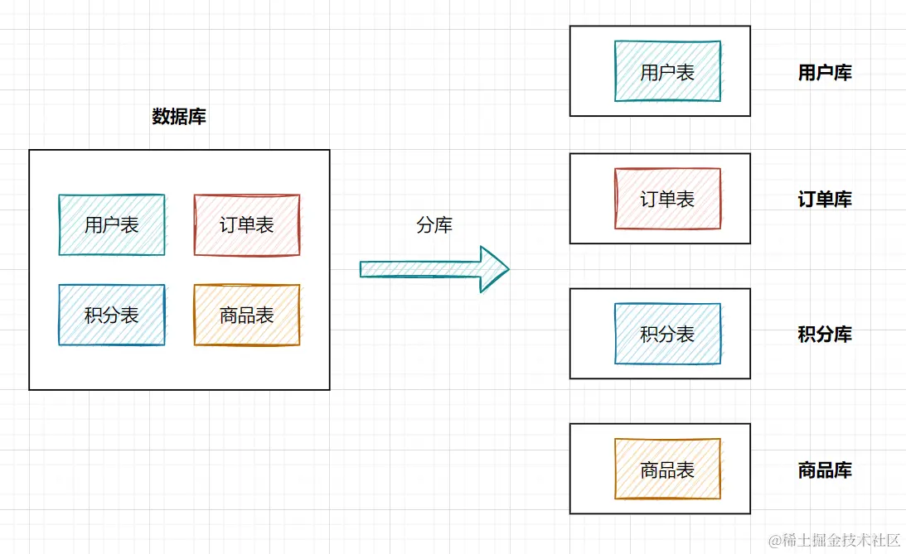
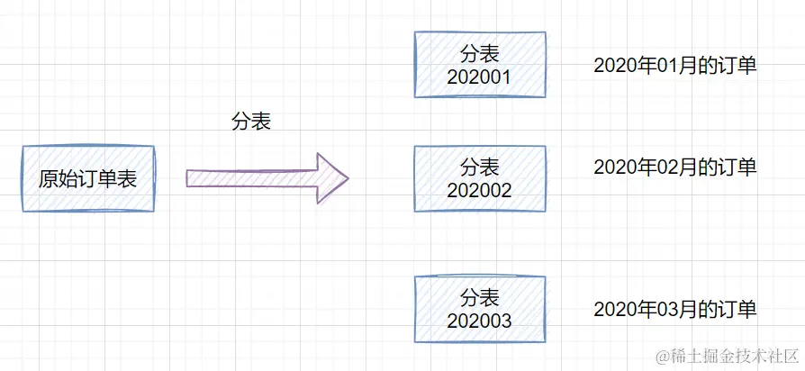
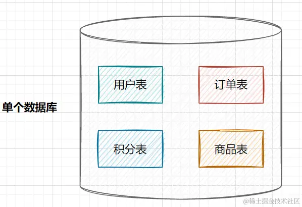
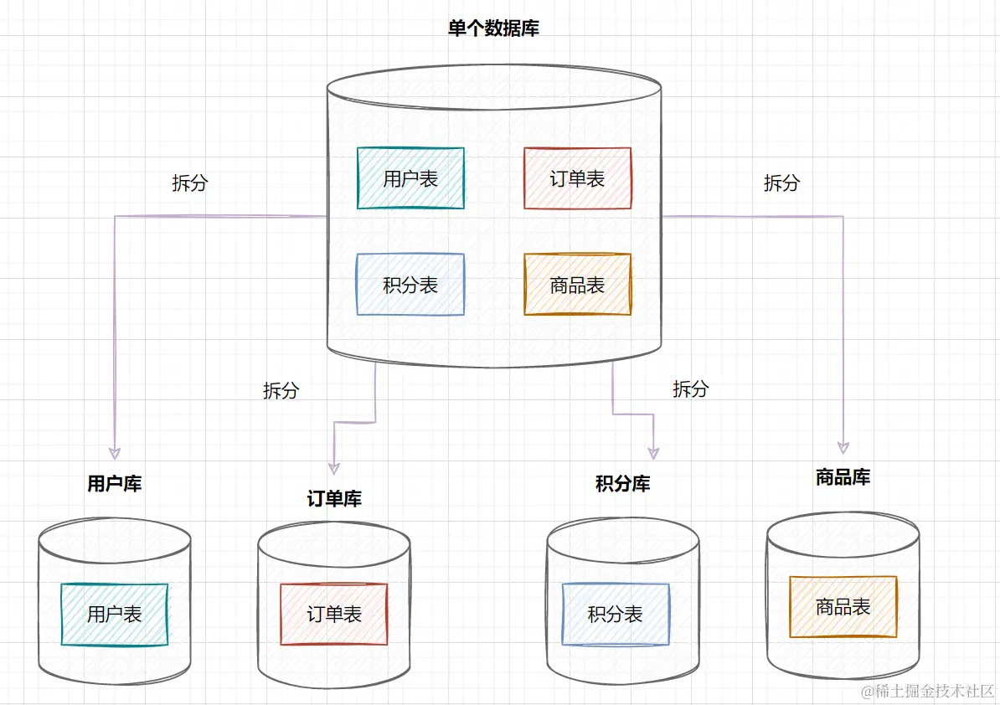
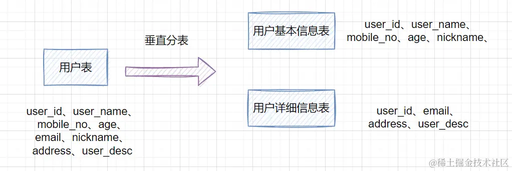
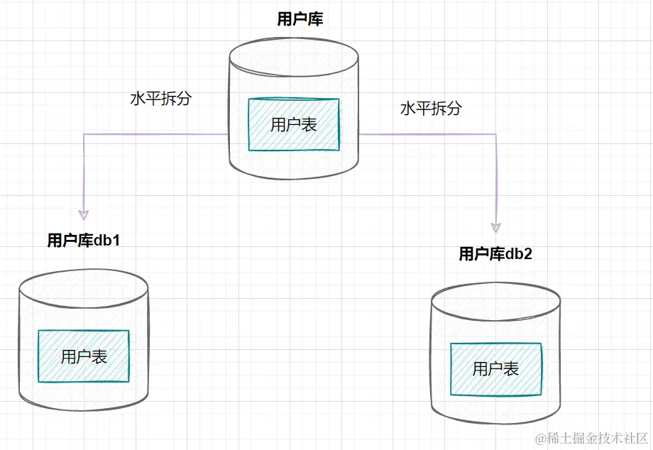

从单机瓶颈到分布式架构，带你系统性掌握分库分表的核心概念。

<!-- truncate -->

# 分库分表-基础理论知识

## 0. 有分布式数据库，为什么还要对MySQL进行分库分表

MySQL本质上是一个单机数据库，并不适合于存储TB级别的数据。

那为什么现在各大互联网公司依然选择使用MySQL进行存储？因为**只有 MySQL 这类关系型数据库，才能提供金融级的事务保证**。

其它的分布式数据库提供的分布式事务，多少都有点残血，都无法达到金融级别的事务保证。

因此即便MySQL不适合存储TB级别的数据，无法支持高并发，各大互联网公司依然选择使用它。

那既然 MySQL 支持不了这么大的数据量，这么高的并发，还必须要用它，怎么解决这个问题呢？利用分片的思想。如果有1TB级别的数据，分成100个片，每个片只需要存储10GB左右的数据，不就可以了吗？

这里的分片实际上就是MySQL分库分表。

## 2. 什么是分库分表

### 什么是分库

就是一个数据库分成多个数据库，部署到不同机器。

### 什么是分表

就是一个数据库表分成多个表。

## 3. 为什么需要分库分表

### 3.1 为什么需要分库

当业务量剧增，数据库可能存在性能瓶颈，这时候就需要进行分库，主要体现在下面两个方面：

* 磁盘存储：业务数据剧增，单机MySQL的磁盘会被撑爆。拆成多个数据库，磁盘使用率大大降低。
* 并发连接数：单机MySQL支持的并发量是有限的，在高并发场景下，用户数量远大于过数据库连接数，MySQL单机是扛不住的。微服务架构出现，就是为了应对高并发。它把订单、用户、商品等不同模块，拆分成多个应用，并且把单个数据库也拆分成多个不同功能模块的数据库（订单库、用户库、商品库），以分担读写压力。

### 3.2 为什么需要分表

数据量太大，SQL查询速度会变慢。

因为MySQL是用B+树来存储用户数据，当数据量过大，B+树的层数就会变多，每次查询IO次数就变多，查询速度就会变慢。

一般来说我们会把B+的层数保持在1-3层（在单行数据约为 1KB 的情况下，3 层 B+ 树大约能支撑 2000 万 条数据。），避免达到4层的高度。因此当数据条数达到千万级别的时候就需要考虑进行分表操作。

<mark>**简单地说，并发高，就分库；数据量大，就分表。**</mark>

## 4. 两个避免

> 越简单的设计可靠性越高。

* 避免为了用分库分表而用分库分表

  在考虑进行分库还是分表之前，需要明确一个原则：能不拆就不拆，能少拆就不多拆。

  把数据拆分得越散，开发和维护难度越大，系统出问题的概率就越大。

  如果业务还在早期阶段，建议优先考虑 **读写分离** 或 **增加缓存层**。只有当数据库连接数、IO 性能或存储空间确实成为瓶颈时，再启动分库分表计划。

* 避免过度设计

  不建议在方案中考虑二次扩容的问题，也就是考虑未来的数据量，把这次分库分表设计的容量都填满了之后，数据如何再次分裂的问题。

  现在技术和业务变化这么快，等真正到了那个时候，业务早就变了，可能新的技术也出来了，你之前设计的二次扩容方案大概率是用不上的，所以没必要为了这个而增加方案的复杂程度。

## 5. 如何分库分表

分库分表有垂直拆分和水平拆分两种方式。

### 5.1 垂直拆分

#### 5.1.1 垂直分库

在业务发展初期，业务功能模块比较少，为了快速上线和迭代，往往采用单个数据库来保存数据。数据库架构如下：

但是随着业务蒸蒸日上，系统功能逐渐完善。这时候，可以按照系统中的不同业务进行拆分，比如拆分成**用户库、订单库、积分库、商品库**，把它们部署在不同的数据库服务器，这就是**垂直分库**。

垂直分库，将原来一个单数据库的压力分担到不同的数据库，可以很好应对高并发场景。数据库垂直拆分后的架构如下：

#### 5.1.2 垂直分表

如果一个单表包含了几十列甚至上百列，管理起来很混乱，每次都`select *`的话，还占用IO资源。这时候，我们可以将一些**不常用的、数据较大或者长度较长的列**拆分到另外一张表。

比如一张用户表，它包含`user_id、user_name、mobile_no、age、email、nickname、address、user_desc`，如果`email、address、user_desc`等字段不常用，我们可以把它拆分到另外一张表，命名为用户详细信息表。这就是垂直分表

### 5.2 水平拆分

#### 5.2.1 水平分库

水平分库是指，将表的数据量切分到不同的数据库服务器上，每个服务器具有相同的库和表，只是表中的数据集合不一样。它可以有效的缓解单机单库的性能瓶颈和压力。

用户库的水平拆分架构如下：

#### 5.2.2 水平分表

如果一个表的数据量太大，可以按照某种规则（如`hash取模、range`），把数据切分到多张表去。

一张订单表，按`时间range`拆分如下：

## X. 参考资料

[阿里面试：我们为什么要分库分表](https://juejin.cn/post/7085132195190276109)

[MySQL存储海量数据的最后一招：分库分表](https://time.geekbang.org/column/article/217568)

gemini yyds