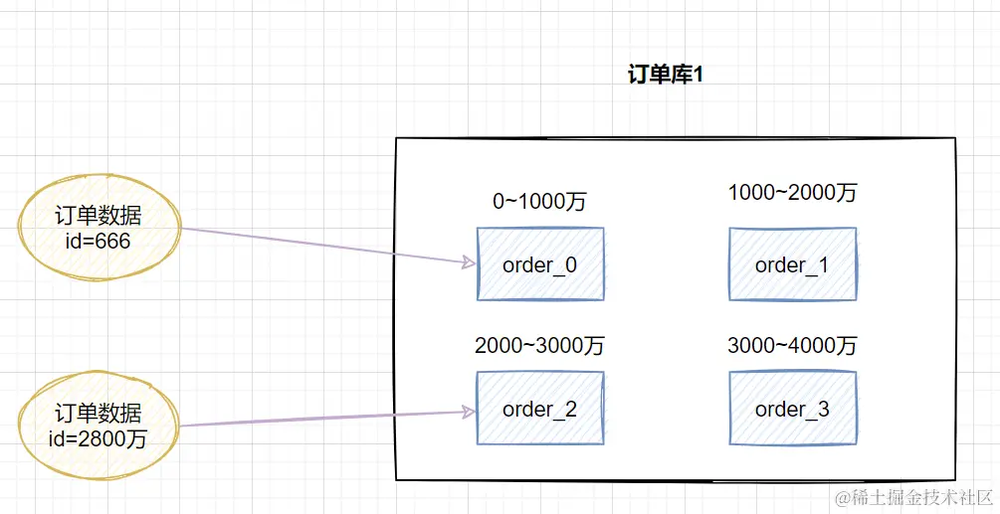
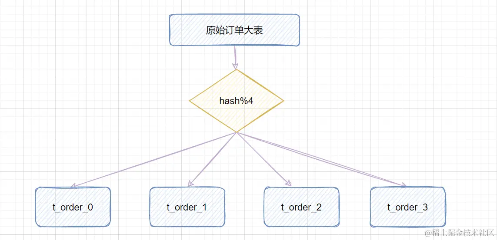
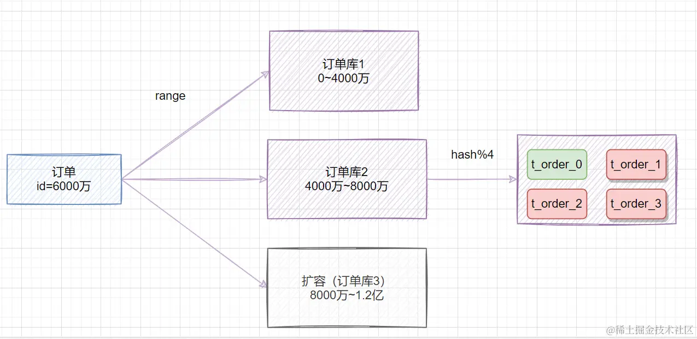
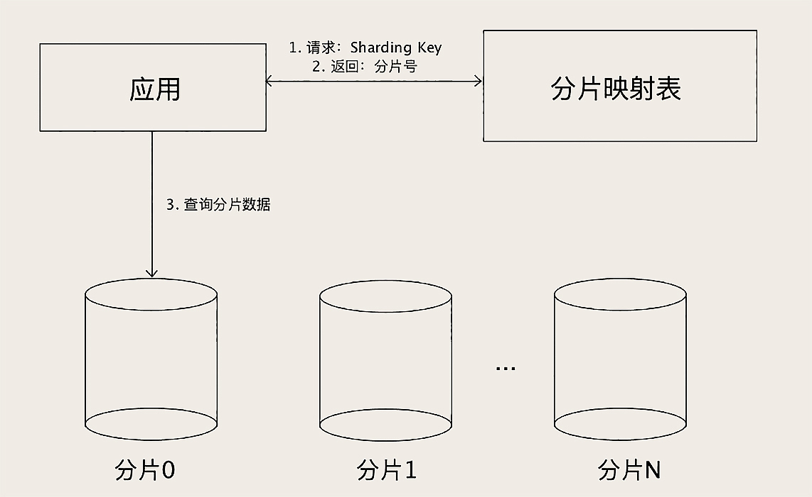
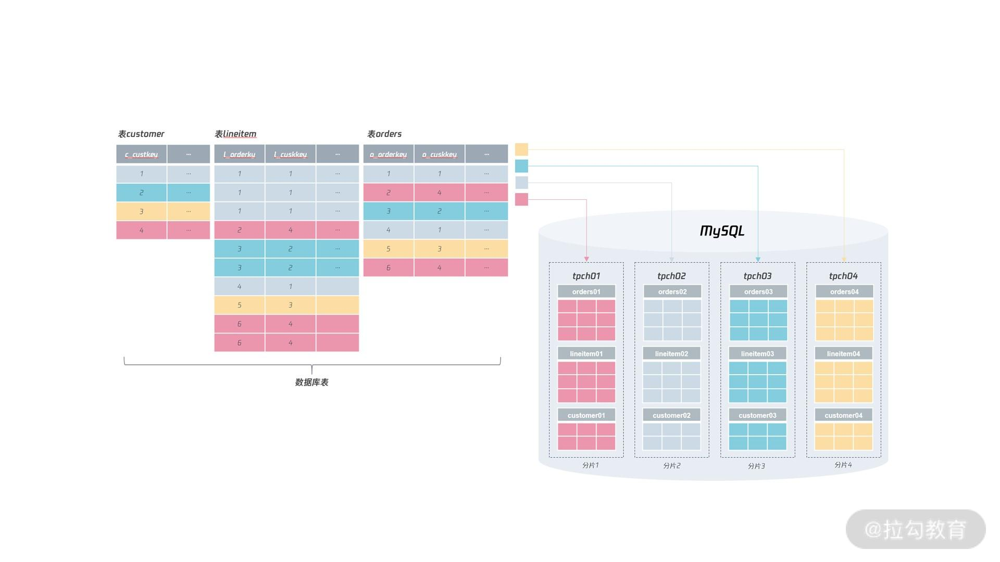
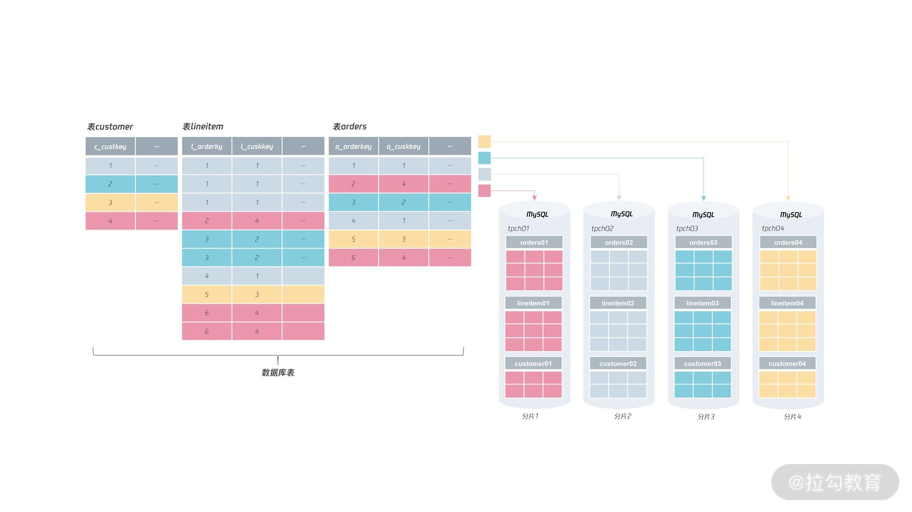
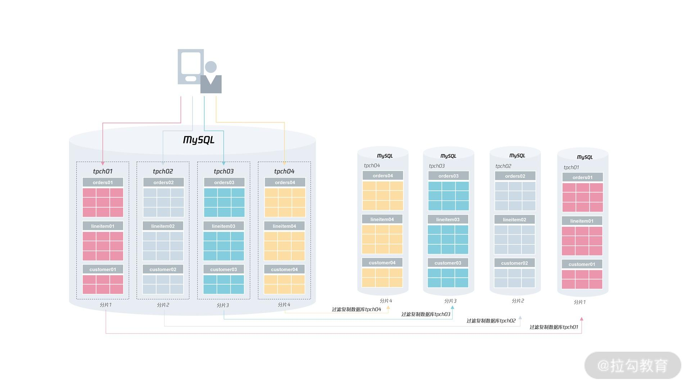
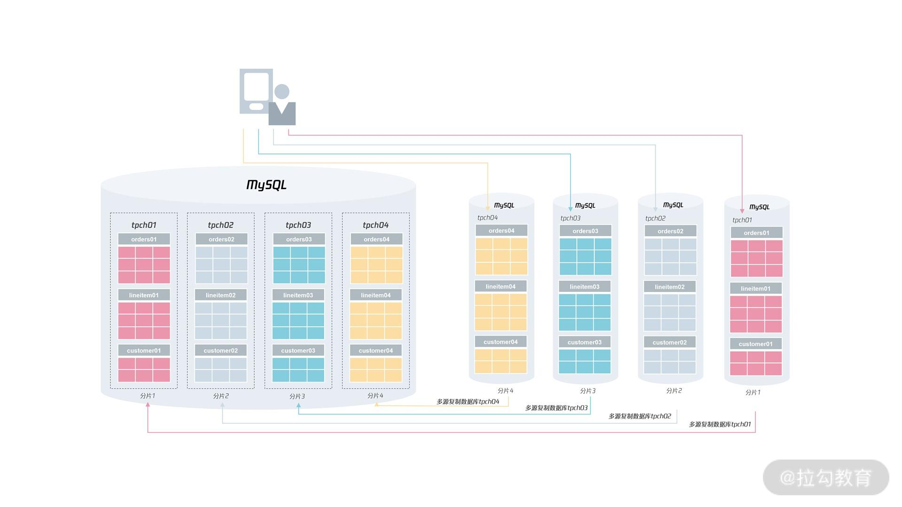
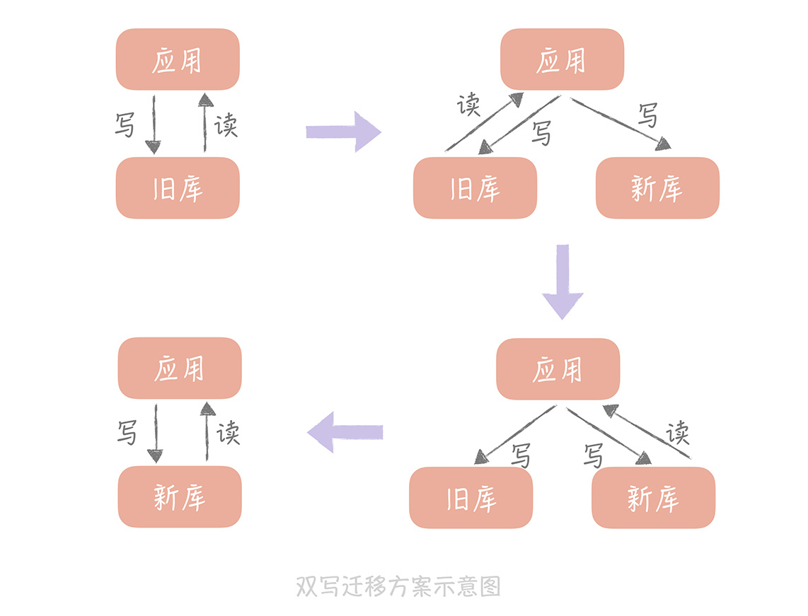

<!-- truncate -->

# 分库分表-进阶理论知识

分库分表设计步骤：

1. 选择 Sharding Key 分片键
2. 选择分库分表算法

选择合适 Sharding Key 和分片算法非常重要，直接影响了分库分表的效果。

## 1. 分库分表如何选择分片键

### 1.1 选择分片键的核心目标

1. 数据分布均匀（避免数据倾斜）
2. 请求分布均匀（避免热点问题）

### 1.2 选择分片键的原则

1. **高频性原则**：分片键应该是业务逻辑中查询频率最高、最核心的字段。

   如果是一个ToC的系统，那么最频繁的就是根据user_id进行查询，查询该用户的各种信息，例如用户信息、购买记录等等，那么就应该用user_id作为分片键。

   如果使用order_id作为分片键，意味着查询经常不带分片键，那就需要经常执行全库扫描，严重影响性能。

2. **数据均匀分布**：避免出现数据倾斜问题。

   例如，如果选择user_id作为分片键，则数据可以均匀地分散在各个分片中。

   选择省份作为分片键，会导致某些库的数据量极大（如广东、上海），而某些库几乎没数据，造成严重的**数据倾斜**。

3. **减少跨分片操作**：相互关联的一组数据，存储在一个分片上（或者说存储在一个数据库实例中）。

   什么是相互关联的一组数据，例如一个用户的用户信息、订单信息、订单明细等，就是相互关联的数据。

   一般来说，这些数据通常会一起查询（join查询），如果都在同一个数据库实例上，join查询只需要在一个实例内部完成计算，速度巨快，且用原生的数据库事务即可，无需考虑分布式事务。如果不在一个实例中，例如用户A的用户信息在实例A，订单信息在实例B，则join查询的时候必须在多个分片抓取数据，产生大量网络开销，性能下降，而且还涉及复杂的分布式事务。

4. **稳定性原则**：分片键值一旦确定，则不能改变。

   假设你用用户的电话号码作为分片键，根据用户的电话号码，该用户数据被路由到分片1。

   用户修改绑定的电话号码之后，用户数据被路由到分片2。

   因此必须将该用户的所有数据重新路由，先从分片1删除，再迁移到分片2。

   原本一个简单的UPDATE语句变成一个复杂的跨库操作。

   一方面，在高并发环境下，会导致响应时间飙升。另一方面，由于涉及到在两个实例中的删除+插入操作，因此还需要引入分布式事务。既增加系统的复杂度还会严重降低系统的性能。

   一般来说，我们会以user_id等无业务意义的逻辑主键作为分片键。即便用户改了昵称、换了头像、注销了手机，这个 ID 依然是他在数据库里的唯一指代，不会发生改变。


举个例子，互联网公司最常用的分片键是user_id。因为互联网公司大部份都是To C的业务，业务的大部份访问都是根据用户ID进行查询。

* 查询我的个人信息
* 查询我的订单信息
* 查询我的访问记录
* ...

对于互联网公司来说，访问量大，数据量多，分库分表是必然的结果。使用user_id作为分片键一方面不会出现热点数据问题，另一方面也能保证相关联的数据都在同一个数据库实例中。

### 1.3  不根据分片键进行的查询怎么办

业务中最频繁的查询场景是需要根据userId进行查询，我用userId作为sharding key，那也有需要根据orderId进行查询的场景，怎么办？我们可以在orderId中选择几位作为userId，例如选定 18 位订单号中，第 10-14 位是用户 ID 的后四位，那我们就可以根据orderId的第 10-14 位结合分片算法来定位到是哪个分片，这就是所谓的基因法。

还有一些场景，我既不是按照orderId也不是按照userId来查询，例如店家希望看到所有自己店铺的订单。针对这种情况，一般我们可以把数据同步到其他存储系统（如ES）来解决，例如构建一个以店铺 ID 作为 Sharding Key 的只读订单库，专门供商家来使用。

所以可以看到，一旦对数据库进行了分库分表，很多查询操作都会受到限制，或者是需要更加复杂的方式才能实现。所以分库分表是其他方案都不好使了，才会考虑去用的方案。

## 2. 水平分库分表算法

水平分库分表策略一般有几种，使用于不同的场景：

- range范围
- hash取模
- range+hash取模混合
- 查表法

> 这些分片相关的知识，不仅仅适用于 MySQL 的分库分表，在使用其他分布式数据库的时候，一样会遇到如何分片、如何选择 Sharding Key 和分片算法的问题，它们的原理都是一样的，所以我们讲的这些方法也都是通用的。

### 2.1 range范围

按照范围策略划分表。

比如我们可以将表的主键，按照从`0~1000万`的划分为一个表，`1000~2000万`划分到另外一个表。如下图：



按时间范围来划分，如不同年月的订单放到不同的表，也属于range范围分表策略。

优点：这种方案扩容时非常方便，不需要数据迁移。假设数据量增加到5千万，只需要水平增加一张表，之前`0~4000万`的数据，不需要迁移。

缺点：这种方案会有热点问题，因为订单id是一直在增大的，也就是说最近一段时间都是汇聚在一张表里面的。比如最近一个月的订单都在`1000万~2000`万之间，平时用户一般都查最近一个月的订单比较多，请求都打到`order_1`表，这就导致表的**数据热点**问题。

适用场景：适合于数据量特别大，并发访问量低的ToB系统。

### 2.2 hash取模

hash取模策略：指定的路由key（一般是user_id、订单id作为key）对分表总数进行取模，把数据分散到各个表中。

比如原始订单表信息，我们把它分成4张分表：



- id=1，对4取模，就会得到1，就把它放到第1张表，即`t_order_0`;
- id=3，对4取模，就会得到3，就把它放到第3张表，即`t_order_2`;

优点：不会存在明显的热点问题。

缺点：扩容时需要进行数据迁移。如果一开始按照hash取模分成4个表了，未来某个时候，表数据量又到瓶颈了，需要扩容，比如你从4张表，又扩容成`8`张表，那之前`id=5`的数据是在（`5%4=1`）第1张表，现在应该放到（`5%8=5`）第`5`张表，也就是说历史数据需要进行迁移。

### 2.3 range+hash取模混合

因为range存在热点数据问题，而不存在扩容数据迁移问题。hash取模不存在热点数据问题，但存在扩容数据迁移问题。

我们将这两种方案融合起来，就能够兼得两者的优势。

第一层：Range

将数据按照某个范围划分成不同的**逻辑组（Group）**。

- 例如：ID 在 `0 ~ 1000万` 的划分为 Group 0，`1000万 ~ 2000万` 的划分为 Group 1。
- **作用**：限定了数据迁移的范围。当你增加 Group 2 时，Group 0 和 1 的数据完全不需要动。

第二层：Hash（决定具体的“库”或“表”）

在每一个 Group 内部，再利用 Hash 取模将数据分散到多个物理库/表中。

- 例如：在 Group 0 内部，通过 `ID % 4` 分散到 4 个物理库。
- **作用**：保证了即便在同一个时间段（或 ID 段）内，压力也能均匀分布到多台服务器上。


这种结合range和hash取模的方式，兼有两者的优点，也互相弥补的对方的缺点：

1. 扩容：当需要扩容的时候，只需要新建一个Group 2，并为Group 2分配一套完整的数据库集群。原本Group 0和Group 1的数据完全不需要进行迁移。
2. 热点问题：即便热点数据集中在最新的Group中，但是在Group内部也会进行分库，因此也能够很好地达到分流的效果。



### 2.4 查表法

查表法，手动决定分配方式。

通过一个分片映射表记录各个sharding key分配在哪个分片上，在执行查询操作的时候，先去分片映射表查询这个sharding key在哪个分片上，然后再去对应的分片查找数据。

当范围分片和哈希分片都无法将数据分匀，就可以用查表法手动将数据分匀。

需要保证分片映射表上的数据不能太多，避免分片映射表本身成为性能瓶颈。

查表法需要二次查询，因此性能比前两种方法差一些，但是分片映射表可以通过缓存来加速查询，实际性能并不会慢很多。



## 3. 分库分表命名

分片的严格定义：

```sql
分片 = 实例 + 库 + 表 = ip@port:db_name:table_name
```

假设对于order订单表，我们使用hash分库分表算法，则对于各个库和各个表有下面几种命名方式：

* 每个分片库名表名都一样，例如库名为mall_db，表名为orders
* 每个分片库名一样，表名不同，例如库名为mall_db，表名为orders01, orders02, orders03...
* 每个分片库名不同，表名都一样，例如库名为mall_db01, mall_db02, mall_db03...，表名为orders
* 每个分片库名和表名都不同，例如分片1库名为mall_db01，表名为orders01；分片2库名为mall_db02，表名为orders02...

**上述四种方式最推荐使用第四种。**

原因一：命名清晰明了。

前三种方式命名都不是完全的解耦，容易混淆。

当你表名或者库名是完全一样的时候，你在进行开发者调试或者日志分析的时候，容易搞不清楚当前操作的是哪一个分片。如果日志只显示orders表名，你也不知道这是哪个库的，除非日志写了这属于哪个库。

而方案4中，由于所有库名和表名都是唯一的，每个分片有唯一坐标表示`<库名，表名>`，因此在调试或者日志分析，一眼就能看出来属于哪个库的哪个表。

原因二：缩容扩容方便。

例如「每个分片库名表名都一样」这种方案，要求每个分片必须在不同MySQL实例。如果你想收缩服务器，例如把实例B的数据搬到实例A来节省成本，是行不通的。

而第四种方式每个分片有唯一坐标表示`<库名，表名>`。一开始，完全可以把所有分片部署在一台实例上面。当业务数据量变得庞大，需要扩容，可以直接将部分分片迁移到其他服务器，不需要进行额外的逻辑层面的数据迁移操作，非常方便。缩容也是类似的。因为每一个分片命名都完全独立，互不影响。

分布式数据库并不一定要求有很多个实例，最基本的要求是将数据进行打散分片。接着，用户可以根据自己的需要，进行扩缩容，以此实现数据库性能和容量的伸缩性。**这才是分布式数据库真正的魅力所在**。

图1:扩容前，所有分片部署在一台MySQL实例中。



图2：扩容后，四个数据库分布在四台实例上。



图3：当活动结束，又可以对资源进行回收，将分片又都放到一台 MySQL 实例上，对资源进行缩容。


## 4. 分片数量要设计得足够多

分片数量在设计的时候一定要够多，避免出现需要改变分片数量的情况。

举个例子，例如一开始你分片分了500片，这个时候一般使用的分片规则是hash(id) % 500

用了一段时间之后发现500片不够，需要涨到1000片，这个时候分片规则变成了hash(id) % 1000

则所有数据都需要重新计算位置，并进行迁移，是一个工程量巨大的事情。

这一种情况，我们称为逻辑拆分，这是在DB设计时就需要避免的问题。

如果说你一开始就分了1000片，一开始业务数据少的时候，你可以把这1000片都部署在一个实例上，并不会浪费资源。

当业务数据增多的时候，一个实例不够用，这个时候你可以直接把部分分片直接搬到其他的实例上，非常方便，也不涉及重新计算库表位置的问题。

核心思想是：**一开始一定要设计足够多的分片**。避免业务运行的中途出现需要改变分片数量的问题。分片数量不用担心过多，因为管理方式都是一样的。

## 5. 扩缩容

扩缩容是什么：例如一开始我们将 4 个分片数据存储在一个 MySQL 实例上。如果遇到一些大促活动，可以对其进行扩容，比如把 4 个分片扩容到 4 个MySQL实例上。如果完成了大促活动，又可以对资源进行回收，将分片又都放到一台 MySQL 实例上，这就是对资源进行缩容。

总的来说，对分布式数据库进行扩缩容在互联网公司是一件常见的操作，比如对阿里来说，每年下半年 7 月开始，他们就要进行双 11 活动的容量评估，然后根据评估结果规划数据库的扩容。一般来说，电商的双 11 活动后，还有双 12、新年、春节，所以一般会持续到过完年再对数据库进行缩容。

如何扩容：

本质是搭建一个复制架构，然后通过设置过滤复制，仅回放分片所在的数据库就行：



然后再找一个业务低峰期，将业务的请求转向新的分片，完成最终的扩容操作：



如何缩容：

本质就是扩容的拟过程，例如我们将上述扩容之后的四个分片再缩容回一个分片，就是将四个分片对应的四个实例的数据都复制到一台实例里面。

## 6. 进行分库分表扩容之后，如何平滑迁移数据

现阶段最主流的方式为「双写方案」，具体步骤如下：

1. 开启双写：

   * 写操作同时作用于新库和旧库
   * 读操作依然走旧库

2. 历史数据迁移：

   利用Canal等离线脚本或迁移工具，将旧库中的数据异步搬到新库。

   由于第一阶段新库已经有新数据，迁移历史数据的过程可能覆盖掉第一阶段的写入的新数据。

   为了避免冲突，在迁移历史数据的过程中，必须判断 `if (old_data.time > new_data.time)`，只有旧库数据更新时才执行覆盖。

3. 数据校验与一致性检查：

   在全量数据迁移完成后，必须确保新旧库数据 100% 一致。

   - 采样校验：随机抽取数据进行比对。
   - 全量校验：跑一边全量比对脚本，记录差异并进行补偿修复。

4. 切读与停双写

   这是最后的上线环节，建议分步执行：

   * 灰度切读：将 10% 的读流量切换到新库，观察报错率和性能。

   * 全量切读：读流量全部切换到新库。

   * 停旧留新：观察一段时间（通常是几天），确认无误后停止双写，移除旧库逻辑。
   * 下线旧库：正式释放旧库资源。




## 7. 分库分表之后可能存在的问题

* 事务问题

  分库分表后，假设两个表在不同的数据库，那么本地事务就无效了，需要使用分布式事务。

* 跨库关联

  Join查询的多张表分散在不同库中，无法直接执行Join，解决这一问题可以分两次查询实现。可以先从库 A 查出 `id` 列表，再到库 B 查详细数据，增加了应用代码的复杂度。另一种解决方式是使用分库分表中间件，例如ShardingShpere，让开发者像操作单机数据库一样操作分布式库。

* 排序问题

  跨节点的count,order by,group by以及聚合函数等问题：可以分别在各个节点上得到结果后在应用程序端进行合并。

* 分页问题

  在各个节点查到对应结果后，在代码端汇聚再分页。

* 分布式ID

  数据库被切分后，不能再依赖数据库自身的主键生成机制，最简单可以考虑UUID，或者使用雪花算法生成分布式ID。

## 8. 分库分表中间件

* Apache ShardingSphere：目前社区最活跃、生态最完整的开源项目。
* MyCat：在 ShardingSphere 崛起之前，MyCat 是国内影响力最大的分库分表中间件。
* TDDL：阿里巴巴内部使用的中间件。
* TiDB：分布式数据库。

## X. 参考资料

[阿里面试：我们为什么要分库分表](https://juejin.cn/post/7085132195190276109)

[MySQL存储海量数据的最后一招：分库分表](https://time.geekbang.org/column/article/217568)

[一次难得的分库分表实践](https://juejin.cn/post/6844903908360323079)

[分布式数据库表结构设计：如何正确地将数据分片？](https://learn.lianglianglee.com/%E4%B8%93%E6%A0%8F/MySQL%E5%AE%9E%E6%88%98%E5%AE%9D%E5%85%B8/23%20%20%E5%88%86%E5%B8%83%E5%BC%8F%E6%95%B0%E6%8D%AE%E5%BA%93%E8%A1%A8%E7%BB%93%E6%9E%84%E8%AE%BE%E8%AE%A1%EF%BC%9A%E5%A6%82%E4%BD%95%E6%AD%A3%E7%A1%AE%E5%9C%B0%E5%B0%86%E6%95%B0%E6%8D%AE%E5%88%86%E7%89%87%EF%BC%9F.md)

gemini
