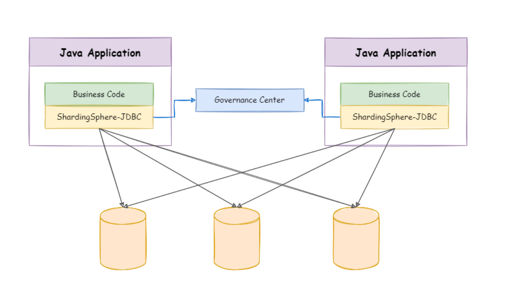
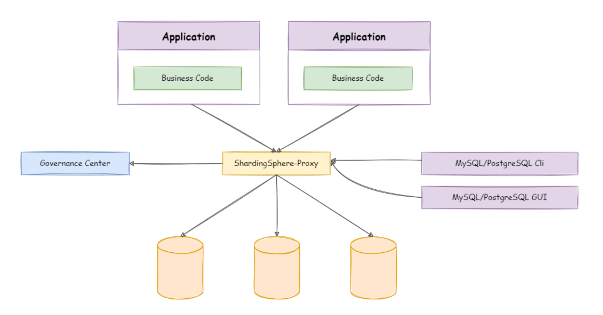

<!-- truncate -->

# ShardingSphere理论与实践

## 1. ShardingSphere是什么

一开始你的数据库部署在单机上，随着数据量越来越庞大，访问量越来越大，单机数据库已经支撑不了当前的需求，你需要进行分库分表、读写分离来支撑当前的业务需求。

当你进行分库分表，就涉及到把一个数据库，拆分成多个，部署在多台服务器上面，ShardingSphere就是你的DB和应用程序的中间层，开发者在写SQL的时候不用管是select哪一个表，只需要写`select ... from user_t`，由ShardingSphere自动帮你计算出来是`select .... from user_01_t`还是`select from user_02_t`。

这里涉及逻辑表和物理表两个概念：

- **逻辑表**：开发者在代码里写的 `user_t`，它是一个虚拟的概念。
- **物理表**：是实际存在于各个服务器硬盘上的 `user_01_t`、`user_02_t`、`user_03_t` 等。 **ShardingSphere 的最大功劳**：就是让开发者“**对分布式的底层细节无感知**”。你以为在操作一张大表，其实它在背后帮你操作一堆小表。

ShardingSphere是如何工作的？

当你发送一条 SQL 给 ShardingSphere 时，它会经历以下几个标准动作：

1. **解析 (Parse)**：它先读懂你的 SQL 想干嘛。
2. **路由 (Route)**：这是最关键的一步。它根据你设定的**分片算法**（比如：`user_id % 2`），计算出这条数据该去哪个库、哪个表。
3. **改写 (Rewrite)**：把你写的 `user_t` 改写成真实的 `user_01_t`。
4. **执行 (Execute)**：把改写后的 SQL 发送到对应的底层数据库。
5. **归并 (Merge)**：如果你查的是全表数据，它会把从各个库搜刮来的结果“拼”在一起，最后还给你一个完整的表格。

ShardingSphere的核心思想是`Database Plus`，其目的不是取代DB，而是增强DB，让普通数据库具备了分布式、高可用和安全加密的能力。

## 2. ShardingSphere有哪些功能

数据分片：将单表大流量拆分为多库多表，通过逻辑表映射物理表，解决单机存储瓶颈。

读写分离：自动让“写操作”去主库，“读操作”去从库，分担压力。

数据加密：可以在数据存入数据库前自动加密，取出来时自动解密，保证安全。

分布式事务：跨了好几个数据库的操作，要么全部成功，要么全部失败，它能帮你保证一致性。

影子库：在线上进行压力测试时，将测试流量路由到独立的隔离数据库，防止压测数据污染生产环境。

## 3. Sharding-JDBC & Sharding-Proxy

Sharding-JDBC和Sharding-Proxy的功能是完全一致的，他们都可以实现数据分片、读写分离、数据加密等等的功能。

他们的区别在于：

Sharding-JDBC是**一个Jar包，它相当于是嵌入在原有的Java程序中**，当你的应用程序编写了一个SQL语句，Sharding-JDBC会拦截并且改写为符合物理表的真正的SQL语句。

Sharding-Proxy是**在你的应用程序以外的一个应用**，当应用程序向DB发起了一个请求，Sharding-Proxy会对其进行拦截，然后再改写，最后发给DB。

Sharding-JDBC仅支持Java语言，Sharding-Proxy只是所有编程语言。

由于Sharding-Proxy多了一层网络转发（应用 --> proxy --> DB），它的性能没有Sharding-JDBC好。

下面两张图分别是Sharding-JDBC和Sharding-Proxy的工作方式。

Sharding-JDBC：

Sharding-Proxy：

## 4. 实践

[手把手教你跑通 ShardingSphere-Example 示例项目](https://tudoupotatoo.github.io/my-blog/blog/sharding-series-04-shardingsphere-examples)

[从零到一，我的 ShardingSphere 摸索与进阶之路](https://tudoupotatoo.github.io/my-blog/blog/sharding-series-05-shardingsphere-learning-roadmap)

## X. 参考资料

[ShardingShpere官方文档](https://shardingsphere.apache.org/document/current/en/overview/)

gemini

> 通过这次学习ShardingSphere，发现一个学习新技术的很好的方式，就是「英文官网 + Monica插件」。之前感觉到读官网很晦涩是因为官网一般比较语言精练简洁，用AI插件能够实现哪里不会问哪里，帮助新手快速入门理解。