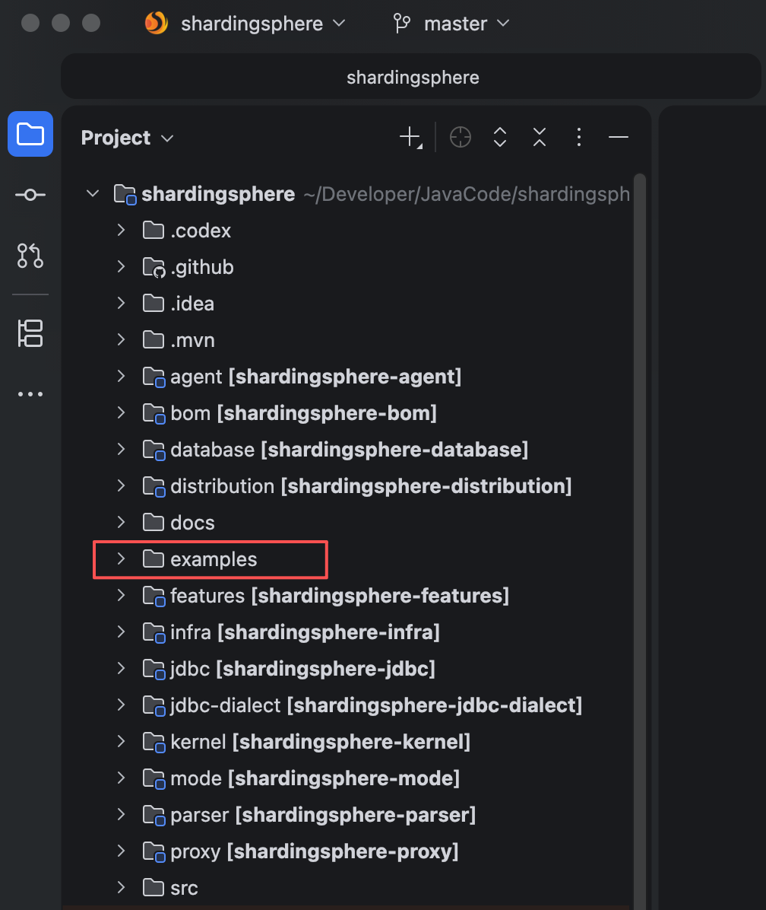
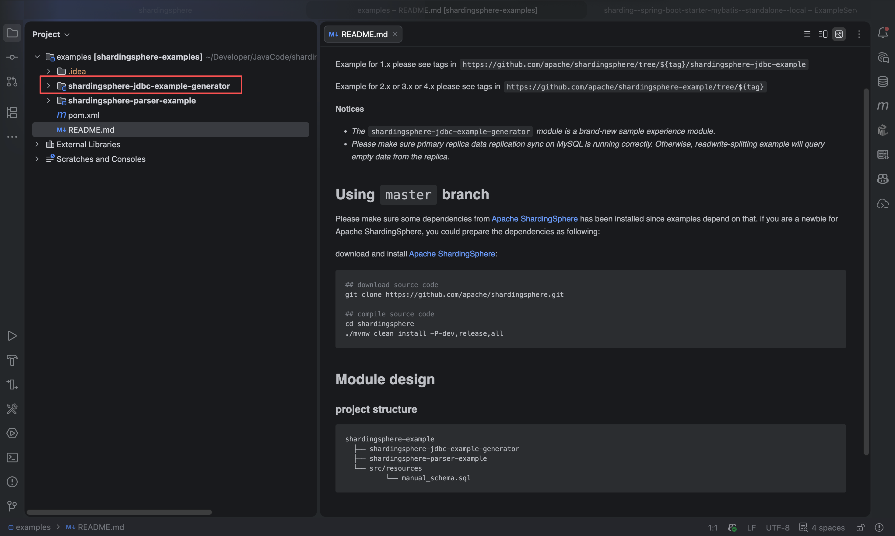
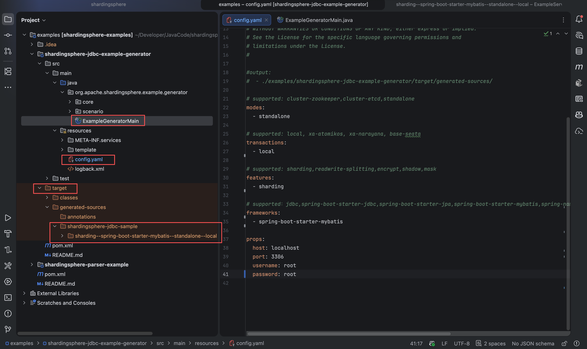
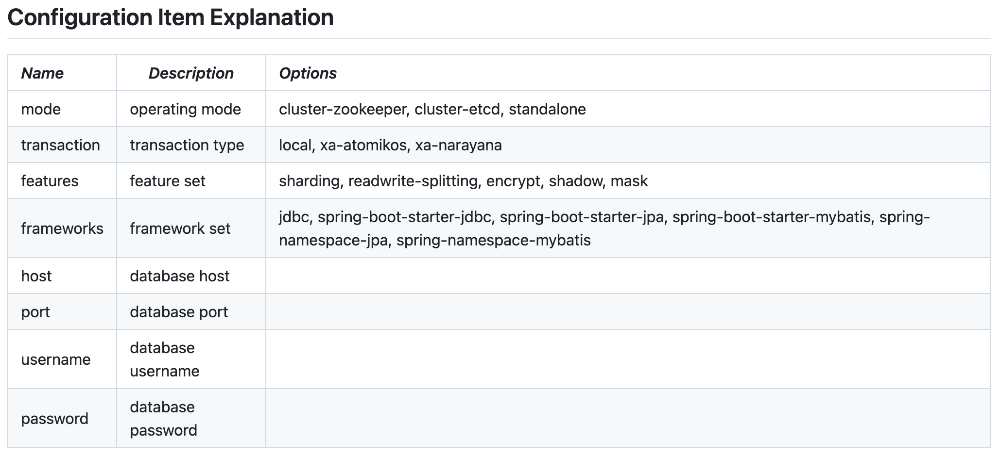
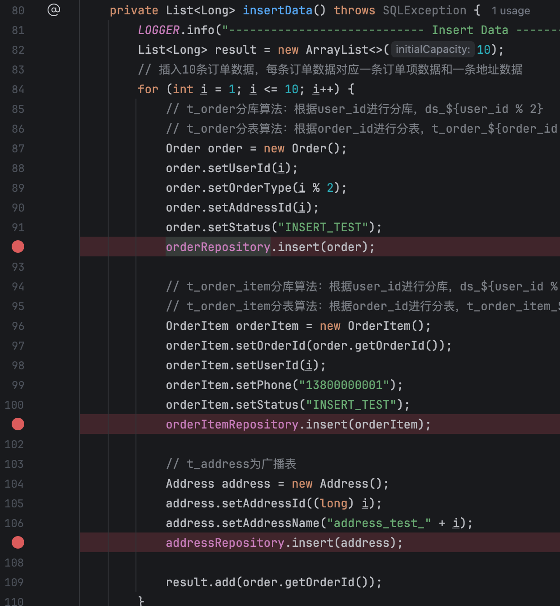
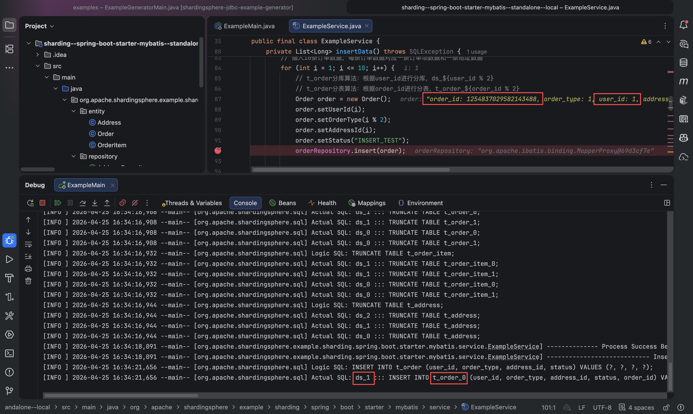
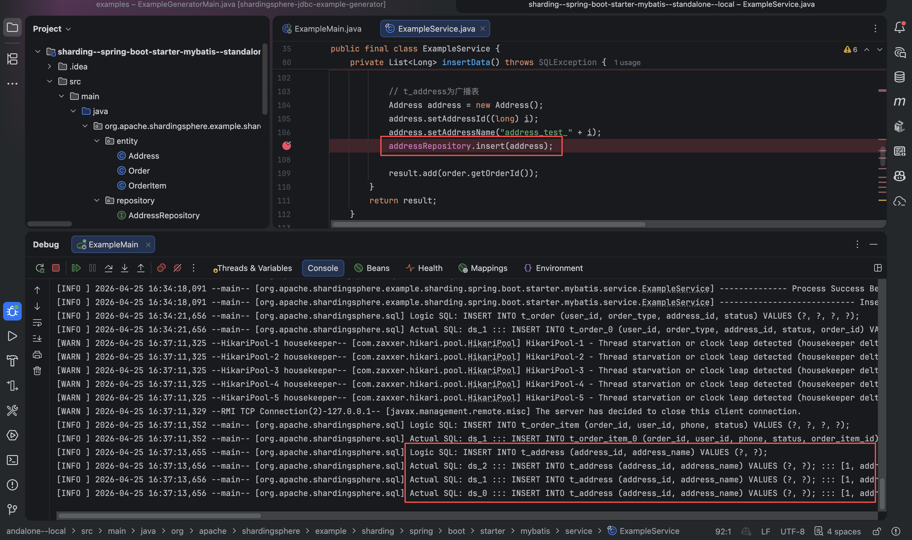
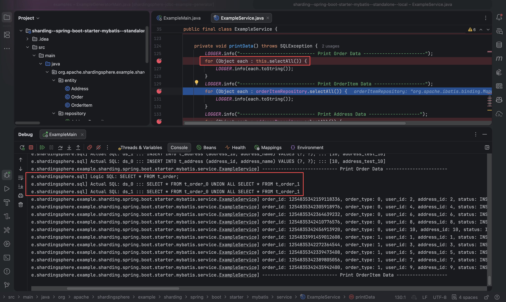

<!-- truncate -->

# 如何通过ShardingSphere-example项目学习ShardingSphere

## 1. 前言

在ShardingSphere的官网[quickstart部分](https://shardingsphere.apache.org/document/current/en/quick-start/)，提供了一个github仓库[ShardingSphere-example](https://github.com/apache/shardingsphere/tree/master/examples)，通过这个仓库可以让开发者快速入门ShardingSphere。

接下来我将介绍一下ShardingSphere-example项目如何使用。

## 2. 环境准备

首先，根据[ShardingSphere-example](https://github.com/apache/shardingsphere/tree/master/examples)的readme来进行前置环境配置：

```bash
## download source code
git clone https://github.com/apache/shardingsphere.git

## compile source code
cd shardingsphere
./mvnw clean install -P-dev,release,all
```


> `./mvnw clean install -P-dev,release,all` 命令的含义：
>
> `./mvnw` (Maven Wrapper)
>
> - **含义**：它是 Maven 的一个封装脚本。
> - **作用**：即使你的电脑没有手动安装 Maven，或者安装的版本不对，它也会自动下载并使用该项目指定版本的 Maven 来执行构建。这保证了编译环境的一致性。
>
> `clean install` (核心动作)
>
> - **`clean`**：清理。删除之前编译生成的 `target` 目录，确保这次是从零开始的“干净”构建。
> - **`install`**：安装。这是 Maven 生命周期的一个阶段。它会完成编译（Compile）、打包（Package），并将生成的 `.jar` 文件拷贝到你本地的 Maven 仓库（通常在 `~/.m2/repository`）。这样，其他的项目程序就能像引用远程依赖一样引用你刚刚编译出来的包。
>
> `-DskipTests` (提速参数)
>
> - **作用**：跳过单元测试。
> - **原因**：ShardingSphere 是一个非常庞大的项目，单元测试有成千上万个。如果全部跑完可能需要几十分钟。作为运行 Example 的前置准备，我们只需要包，不需要验证测试用例。
>
> `-P-dev,release,all` (环境配置/Profiles)
>
> Maven 通过 `-P` 来激活或禁用特定的配置（Profiles）：
>
> | **参数**      | **含义**              | **作用**                                                     |
> | ------------- | --------------------- | ------------------------------------------------------------ |
> | **`-dev`**    | **禁用** dev 配置     | 注意前面的减号 `-`。这表示在构建时**关掉**开发环境配置（比如关闭调试日志、不使用测试数据库）。 |
> | **`release`** | **激活** release 配置 | 开启发布模式。通常会包含：代码混淆、生成 Javadoc 文档、对 Jar 包进行 GPG 签名等。 |
> | **`all`**     | **激活** all 配置     | 告诉 Maven 编译项目下的**所有模块**。在大型微服务项目中，默认可能只编译核心模块，加上 `all` 会编译插件、示例、代理等所有组件。 |
>
> 
>
> 为什么要先执行 `./mvnw clean install -DskipTests -P-dev,release,all` ？
>
> 是为了给当前master版本的shardingsphere打一个jar包，因为shardingsphere-example依赖shardingsphere的某些核心组件，给shardingsphere打一个jar包以便于shardingsphere-example能够成功引入所需要的依赖。
>
> 为什么需要手动打包而不是直接用maven下载依赖？
>
> 一方面，最新的master代码可能还没有正式发布到中央仓库，从仓库可能下载不到最新master代码的依赖包。
>
> 另一方面，shardingsphere-example可能依赖的是snap-shot版本代码，只有正式版本代码会被打包发布到中央仓库，snap-shot版本代码不会被打包发布到中央仓库。因此无法从中央仓库引入snap-shot版本的shardingsphere依赖。
>
> 综上，将代码下载到本地，在本地打包，可以保证shardingsphere-example使用的shardingsphere包就是本地最新打的那个包，保证依赖能够成功引入，代码能够正常运行。

## 3. 使用example-generator生成示例Demo

至此，环境已经准备完毕。我们可以在idea单独打开shardingsphere下面的example模块。



可以看到项目结构如下图



我们就是要用这个`shardingsphere-jdbc-example-generator`来生成示例Demo代码。

具体是怎么生成的呢？

我们知道`shardingsphere`本身是提供了很多功能的，在入门的时候，你可能并不希望看一个包含各种功能的、过于庞大的项目，你可能只是希望只关注某一个功能，例如最经典的分库分表，学习这一个功能怎么用。

在`config.yaml`中，你可以只配置示例代码需要包含的功能，像我这里的配置就是最简单的「单机模式+本地事务+分库分表功能+Spring Boot + MyBatis技术栈」。不包含影子库、加密等复杂功能。对新手非常友好。

配置完成之后，你执行`ExampleGeneratorMain`类中的main方法，就会为你生成示例项目代码 `sharding--spring-boot-starter-mybatis--standalone--local` 放在target目录下（这个示例项目名称也是根据你的配置所起的）。



然后你再单独在一个idea窗口打开这个示例项目即可直接运行项目了。

是不是非常简单？！

只需要在`config.yaml`配置上你希望包含的shardingsphere功能、你使用的框架以及数据库连接信息等基本信息，Generator就能够直接为你生成一个简单的示例Demo。

在[shardingsphere-example项目的readme](https://github.com/apache/shardingsphere/blob/master/examples/shardingsphere-jdbc-example-generator/README.md)中有conf.yaml配置可选值的完整介绍。



## 4. 通过示例Demo学习shardingsphere

接下来我们一起看一下这个按照`单机模式+本地事务+分库分表功能+Spring Boot + MyBatis技术栈`这个配置所生成的Demo示例项目，应该怎么学习这个Demo项目。

分三步来进行：

1. 读懂`conf.yaml`
2. 看懂业务代码
3. debug运行并观察

### 4.1 读懂conf.yaml

在读`conf.yaml`文件之前，我们先看一下`application.properties`文件。就是在这里，将驱动设置为ShardingSphereDriver，将数据源定义在`conf.yaml`，`conf.yaml`本质上就是ShardingSphere配置文件，定义了数据源在哪，数据如何分片等等ShardingSphere所需的信息。

```properties
# 指定MyBatis的MapperXML文件位置
mybatis.mapper-locations=classpath*:mappers/*Mapper.xml

# 下面的配置的含义是：启用shardingsphere，并且告诉shardingsphere，其配置文件在conf.yaml
# 定义数据库驱动
spring.datasource.driver-class-name=org.apache.shardingsphere.driver.ShardingSphereDriver
# 定义数据源URL，指向ShardingSphere的配置文件
spring.datasource.url=jdbc:shardingsphere:classpath:config.yaml
```


接下来，就一起来看看`conf.yaml`文件中的内容：

> 配置方式官网介绍：
>
> https://shardingsphere.apache.org/document/current/en/user-manual/shardingsphere-jdbc/

```yaml
#
# Licensed to the Apache Software Foundation (ASF) under one or more
# contributor license agreements.  See the NOTICE file distributed with
# this work for additional information regarding copyright ownership.
# The ASF licenses this file to You under the Apache License, Version 2.0
# (the "License"); you may not use this file except in compliance with
# the License.  You may obtain a copy of the License at
#
#     http://www.apache.org/licenses/LICENSE-2.0
#
# Unless required by applicable law or agreed to in writing, software
# distributed under the License is distributed on an "AS IS" BASIS,
# WITHOUT WARRANTIES OR CONDITIONS OF ANY KIND, either express or implied.
# See the License for the specific language governing permissions and
# limitations under the License.
#

mode:
  type: Standalone  # Standalone (单机模式)：所有的分片规则、数据库连接信息都只保存在当前的这台服务器。
                    # 与之相对的是 Cluster（集群模式），后者通常配合 ZooKeeper 或 Etcd 使用，实现配置共享。如果你在管理界面改了一个分片算法，ZooKeeper 会立刻“广播”给所有连接的服务器，所有服务器会同时生效，不需要重启。
  repository:
    type: JDBC  # 这意味着 ShardingSphere 会把你写在 YAML 里的这些规则（比如哪张表分到哪个库）同步存入数据库的一张表里。
                # 为什么要把规则存在数据库里面？
                # 如果规则只写在 conf.yaml 里，它是静态的。
                # 如果你想修改一个分片算法，或者增加一个数据库节点，你必须：1. 修改所有服务器上的 YAML 文件  2. 重启所有应用。
                # 在生产环境中，重启应用意味着服务中断。而把规则写到数据库（或 ZooKeeper）中，就实现了配置中心化：
                # 动态生效：你在管理后台改一下规则，数据库里的记录随之改变。ShardingSphere 的各个节点会监听到这个变化，直接在内存里更新逻辑，无需重启。
                # 集中管理：如果你有 100 台服务器运行着同一个服务，你不需要分发 100 份 YAML，所有节点都去同一个数据库读规则即可。
    props:
      jdbcUrl: jdbc:mysql://localhost:3306/demo_ds_0?serverTimezone=UTC&useSSL=false&useUnicode=true&characterEncoding=UTF-8&allowPublicKeyRetrieval=true
      username: root
      password: root

# 告诉SharingSphere中间件：“我有哪几个真实的数据库可以存数据，以及我该如何连接它们。”
dataSources:
  ds_0:  # 逻辑名称 类似于外号
    dataSourceClassName: com.zaxxer.hikari.HikariDataSource
    driverClassName: com.mysql.cj.jdbc.Driver
    jdbcUrl: jdbc:mysql://localhost:3306/demo_ds_0?serverTimezone=UTC&useSSL=false&useUnicode=true&characterEncoding=UTF-8&allowPublicKeyRetrieval=true
    username: root
    password: root
    maxPoolSize: 10
  ds_1:
    dataSourceClassName: com.zaxxer.hikari.HikariDataSource
    driverClassName: com.mysql.cj.jdbc.Driver
    jdbcUrl: jdbc:mysql://localhost:3306/demo_ds_1?serverTimezone=UTC&useSSL=false&useUnicode=true&characterEncoding=UTF-8&allowPublicKeyRetrieval=true
    username: root
    password: root
    maxPoolSize: 10
  ds_2:
    dataSourceClassName: com.zaxxer.hikari.HikariDataSource
    driverClassName: com.mysql.cj.jdbc.Driver
    jdbcUrl: jdbc:mysql://localhost:3306/demo_ds_2?serverTimezone=UTC&useSSL=false&useUnicode=true&characterEncoding=UTF-8&allowPublicKeyRetrieval=true
    username: root
    password: root
    maxPoolSize: 10

rules:
- !SHARDING  # 定义分片规则
    tables:
      t_order:  # 定义t_order表的分片规则
        actualDataNodes: ds_$->{0..1}.t_order_$->{0..1}
                        # 四个节点：ds_0.t_order_0、ds_0.t_order_1、ds_1.t_order_0、ds_1.t_order_1
        tableStrategy:
          standard:
            shardingColumn: order_id  # 分片键
            shardingAlgorithmName: t_order_inline  # 分片算法
      t_order_item:  # 定义t_order_item表的分片规则
        actualDataNodes: ds_$->{0..1}.t_order_item_$->{0..1}
        tableStrategy:
          standard:
            shardingColumn: order_id
            shardingAlgorithmName: t_order_item_inline
    bindingTables:  # 告诉ShardingSphere，这两张表分片规则完全一样，分片键一样，分片算法也一样，关联的数据都在同一个分片上，则执行join查询的时候ShardingSphere就在同一个分片上查询，不会跨分片查询，效率更高。
      - t_order,t_order_item
    defaultDatabaseStrategy:  # 默认分库策略
      standard:
        shardingColumn: user_id  # 以user_id作为分片键
        shardingAlgorithmName: database_inline  # 分片算法
    # 定义分布式全局唯一 ID 生成策略
    keyGenerateStrategies:
      t_order_order_id:  # t_order_order_id是策略名 下面的定义表示为t_order表的order_id列采用snowflake_generator雪花算法生成全局唯一ID
        keyGenerateType: column
        keyGeneratorName: snowflake_generator
        logicTable: t_order
        keyGenerateColumn: order_id
      t_order_item_order_item_id:
        keyGenerateType: column
        keyGeneratorName: snowflake_generator
        logicTable: t_order_item
        keyGenerateColumn: order_item_id

    shardingAlgorithms:  # 定义分片算法
      database_inline:
        type: INLINE  # 行表达式：即通过一个简单的表达式来定义分片算法
        props:
          algorithm-expression: ds_${user_id % 2}  # 以user_id对2取模，结果为0或1，分别对应ds_0和ds_1两个数据库

      t_order_inline:
        type: INLINE
        props:
          algorithm-expression: t_order_$->{order_id % 2}
      t_order_item_inline:
        type: INLINE
        props:
          algorithm-expression: t_order_item_$->{order_id % 2}
    keyGenerators:
      snowflake_generator:
        type: SNOWFLAKE
    
- !BROADCAST  # 广播表：广播表不分片，它在每个数据库实例中都拥有一份完全相同的完整副本。假设你有三个物理库 ds_0, ds_1, ds_2。当你把 t_address 设置为广播表时，这三个库里都会有一个叫 t_address 的物理表，且里面的数据一模一样。
              # 为什么需要广播表？避免跨库join，有一些表数据量不大，例如地址表，这些表经常和其他表进行关联查询。
              # 如果地址表 t_address 只在 ds_0 里，那么住在 ds_1 里的订单想要关联地址，就必须跨库去找 ds_0。这种跨库操作非常慢且复杂。
              # 使用广播表，在每个分片都有一份，则在任何分片上查询订单时，都能直接关联到地址表，无需跨库查询，效率大大提升。
    tables:
      - t_address

props:
  sql-show: true  # 在控制台打印出 ShardingSphere 生成的 SQL 语句，方便调试和理解分片规则的执行过程。
                  # 假设你执行了：SELECT * FROM t_order WHERE user_id = 10。
                  # 开启 sql-show: true 后，你会看到类似这样的日志：
                  # Logic SQL: SELECT * FROM t_order WHERE user_id = 10
                  # Actual SQL: ds_0 ::: SELECT * FROM t_order_0 WHERE user_id = 10

```

通过`conf.yaml`配置文件，可以非常清楚当前的分片算法是这样的：有`ds_0`、`ds_1`、`ds_2`三个库。逻辑表有`t_order`、`t_order_item`、`t_address`三张表。

其中`t_order`和`t_order_item`进行了分片。

分库的shardingKey为`user_id`，分片算法为`ds_${user_id % 2}`

分表的shardingKey都为`order_id`，`t_order`的表分片算法为`t_order_$->{order_id % 2}`，`t_order_item`的表分片算法为`t_order_item_$->{order_id % 2}`

`t_address`是广播表，没有进行分片。

### 4.2 读懂业务代码

`ShardingShpere-Example-Generator`生成的业务代码比较简单，所以不用担心会看不懂。

先进入主类，点进`exampleService.run()`方法内部

```java
@MapperScan("org.apache.shardingsphere.example.sharding.spring.boot.starter.mybatis.repository")
@SpringBootApplication
public class ExampleMain {
    
    public static void main(final String[] args) throws SQLException {
        try (ConfigurableApplicationContext applicationContext = SpringApplication.run(ExampleMain.class, args)) {
            ExampleService exampleService = applicationContext.getBean(ExampleService.class);
            exampleService.run();
        }
    }
}
```

```java
@Service
public final class ExampleService {
    // ...
    public void run() throws SQLException {
        try {
            this.initEnvironment();
            this.processSuccess();
        } finally {
            this.cleanEnvironment();
        }
    }
}
```


```java
private void initEnvironment() throws SQLException {
    // 建表
    orderRepository.createTableIfNotExists();
    orderItemRepository.createTableIfNotExists();
    addressRepository.createTableIfNotExists();
    // 清空表中的所有数据
    orderRepository.truncateTable();
    orderItemRepository.truncateTable();
    addressRepository.truncateTable();
}
```


```java
private void processSuccess() throws SQLException {
    LOGGER.info("-------------- Process Success Begin ---------------");
    List<Long> orderIds = insertData();
    printData(); 
    deleteData(orderIds);
    printData();
    LOGGER.info("-------------- Process Success Finish --------------");
}
```


```java
private List<Long> insertData() throws SQLException {
    LOGGER.info("---------------------------- Insert Data ----------------------------");
    List<Long> result = new ArrayList<>(10);
    // 插入10条订单数据，每条订单数据对应一条订单项数据和一条地址数据
    for (int i = 1; i <= 10; i++) {
        Order order = new Order();
        order.setUserId(i);
        order.setOrderType(i % 2);
        order.setAddressId(i);
        order.setStatus("INSERT_TEST");
        orderRepository.insert(order);

        OrderItem orderItem = new OrderItem();
        orderItem.setOrderId(order.getOrderId());
        orderItem.setUserId(i);
        orderItem.setPhone("13800000001");
        orderItem.setStatus("INSERT_TEST");
        orderItemRepository.insert(orderItem);

        Address address = new Address();
        address.setAddressId((long) i);
        address.setAddressName("address_test_" + i);
        addressRepository.insert(address);

        result.add(order.getOrderId());
    }
    return result;
}
```


```java
private void printData() throws SQLException {
    LOGGER.info("---------------------------- Print Order Data -----------------------");
    for (Object each : orderRepository.selectAll()) {
        LOGGER.info(each.toString());
    }
    LOGGER.info("---------------------------- Print OrderItem Data -------------------");
    for (Object each : orderItemRepository.selectAll()) {
        LOGGER.info(each.toString());
    } 
    LOGGER.info("---------------------------- Print Address Data -------------------");
    for (Object each : addressRepository.selectAll()) {
        LOGGER.info(each.toString());
    }
}
```


```java
private void deleteData(final List<Long> orderIds) throws SQLException {
    LOGGER.info("---------------------------- Delete Data ----------------------------");
    long count = 1;
    for (Long each : orderIds) {
        orderRepository.delete(each);
        orderItemRepository.delete(each);
        addressRepository.delete(count++);
    }
}
```


```java
private void cleanEnvironment() throws SQLException {
    orderRepository.dropTable();
    orderItemRepository.dropTable();
    addressRepository.dropTable();
}
```


可以看到业务代码非常简单，就做了这样几件事：

1. 建表
2. 插入10条order数据，每条数据对应一条order_item和address数据
3. 打印数据
4. 清空数据
5. 打印数据
6. 删除表

### 4.3 debug运行并观察

看`conf.yaml`文件，你可以知道是如何进行分库分表的。通过debug运行并观察，你可以看到底层的执行过程，验证是否与在`conf.yaml`所配置的是相符的。

你可以在关键的地方打一些断点，并观察日志的输出信息，就像我图中这样。为了验证你学习的有效性，你可以在看打印的日志之前，先自己想一下应该是操作哪个库和哪个表，然后再看日志验证一下你的理解是否正确。



举个例子：

我在insert order的地方打了一个断点，可以看到user_id=1，order_id以8结尾，因此应该是在ds_1库t_order_0表。再看打印的日志是如何预期的。




再看一下insert t_address，由于这是一个广播表，因此插入数据时应该要往三个库的t_address表都要插入数据。看日志也是符合预期的。




再看一下查询语句，我再selectAll order表的地方打了断点。

应该要查询ds0和ds1中的所有表，看日志可以看到现在ds0对t_order_0和t_order_1进行了union查询，再在ds1执行了相同的操作，也是符合预期的。




上面只是举了几个例子，边幅有限，就不每一步都展示出来了。

真正要理解最好还是自己手动debug，边想边看，这样理解才会更加深刻。

## 5. 番外

如果你一步步跟着debug的话，你可能会发现一个有趣的现象，就是每次生成的order_id都是偶数，这是偶然还是必然呢？

这在单机场景下是一种必然。为什么会这样？

通过上面的`conf.yaml`，我们知道order_id是通过雪花算法生成的。

```yaml
keyGenerateStrategies:
  t_order_order_id:
    keyGenerateType: column
    keyGeneratorName: snowflake_generator
    logicTable: t_order
    keyGenerateColumn: order_id
```

雪花算法生成的 64 位长整型 ID 由以下几个部分组成：

* 1 位符号位：始终为 0。
* 41 位时间戳：精确到毫秒。
* 10 位工作机器 ID：用来区分不同的机器。
* 12 位序列号：用来区分同一毫秒内生成的不同 ID。

根本原因在于第 4 部分（序列号）：

雪花算法在每一毫秒开始时，序列号默认会重置为 0。

如果你的项目是单机测试或者非高并发场景，基本上每次插入数据的间隔都会大于 1 毫秒。

这意味着，每次生成 ID 时，它的时刻都是一个新的毫秒，序列号始终是 0。

因为二进制的最后一位（0）决定了奇偶性，这就导致生成的全局唯一 ID 的最后一位永远是 0，即生成的 ID 必定是偶数。

